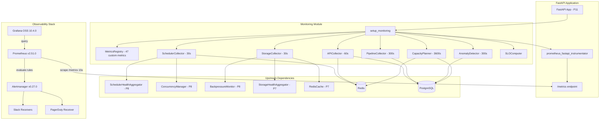
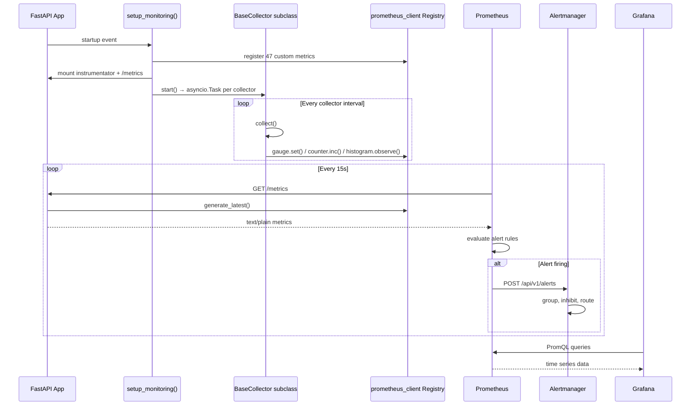
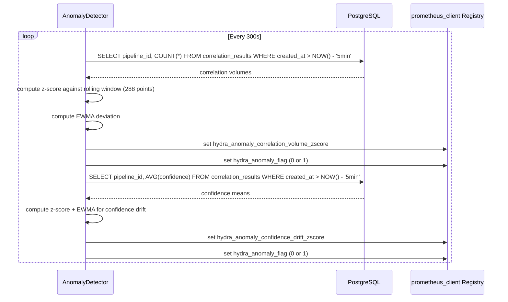
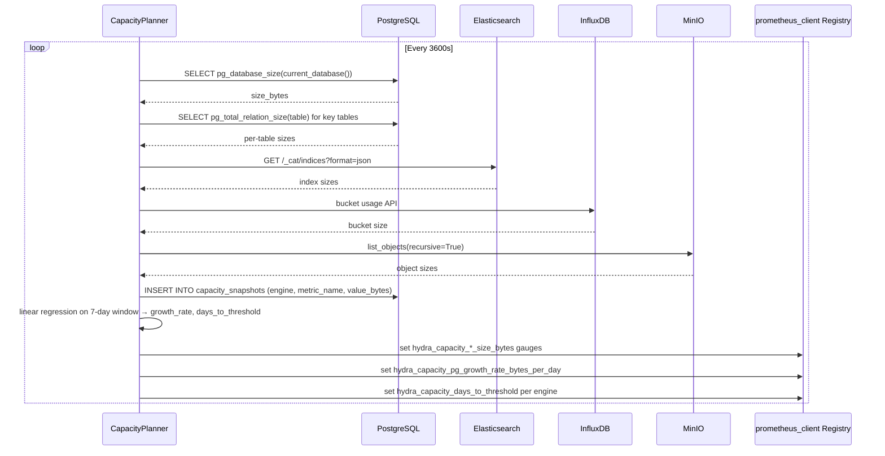

# Design Document: P12 Monitoring & Alerting

## Overview

P12 builds the observability layer for the HYDRA OSINT Platform, making operational state visible, alertable, and forecastable. It integrates Prometheus-compatible metrics exposition, background metric collectors, alert rule definitions, Grafana dashboards, SLO/SLI tracking with error budget burn rates, statistical anomaly detection, and capacity planning with storage growth projection.

The system hooks into the existing P11 FastAPI application via a `setup_monitoring()` entry point that instruments HTTP endpoints, starts background collector tasks, and initializes anomaly detection and capacity planning subsystems. Four concrete collectors (Scheduler, Storage, API, Pipeline) scrape internal state on configurable intervals and push values into the `prometheus_client` registry. Prometheus scrapes the `/metrics` endpoint at 15-second intervals, evaluates alert rules and recording rules, and forwards firing alerts to Alertmanager for routing to Slack/PagerDuty receivers. Five provisioned Grafana dashboards provide operational visibility across all subsystems.

The design prioritizes zero-coupling to cloud-native monitoring services (CloudWatch, Datadog) in favor of self-hosted Prometheus + Alertmanager + Grafana, consistent with HYDRA's infrastructure-agnostic philosophy. All dashboard and alert definitions are version-controlled. Statistical anomaly detection uses z-score and EWMA methods on correlation volume and confidence drift. Capacity planning uses linear regression on storage size snapshots persisted in PostgreSQL.

## Architecture



## Sequence Diagrams

### Metrics Collection & Scrape Cycle



### Anomaly Detection Cycle



### Capacity Planning Cycle



## Components and Interfaces

### Component 1: MonitoringSettings

**Purpose**: Configuration model for all monitoring subsystem parameters, nested under `HydraSettings.monitoring`.

```python
class MonitoringSettings(BaseModel):
    # Collector intervals (seconds)
    scheduler_collector_interval: float = 30.0
    storage_collector_interval: float = 30.0
    api_collector_interval: float = 60.0
    pipeline_collector_interval: float = 300.0

    # Anomaly detection
    anomaly_detection_interval: float = 300.0
    anomaly_zscore_threshold: float = 3.0
    anomaly_ewma_span: int = 24
    anomaly_window_size: int = 288  # 24h of 5-min samples

    # Capacity planning
    capacity_planning_interval: float = 3600.0
    capacity_pg_threshold_bytes: int = 100 * 1024**3      # 100 GB
    capacity_es_threshold_bytes: int = 50 * 1024**3        # 50 GB
    capacity_influx_threshold_bytes: int = 50 * 1024**3    # 50 GB
    capacity_minio_threshold_bytes: int = 500 * 1024**3    # 500 GB
    capacity_history_retention_days: int = 90

    # SLO targets
    slo_adapter_success_target: float = 0.995
    slo_api_availability_target: float = 0.999
    slo_api_latency_p95_target: float = 0.99
    slo_api_latency_threshold_seconds: float = 2.0
    slo_product_generation_target: float = 0.99
    slo_ingestion_freshness_target: float = 0.98
    slo_storage_availability_target: float = 0.999
    slo_window_days: int = 30
    slo_short_window_days: int = 7

    # Structured logging
    log_format: str = "json"
    log_level: str = "INFO"

    # Prometheus
    metrics_path: str = "/metrics"
    scrape_interval_seconds: int = 15
    retention_days: int = 15
```

**Responsibilities**:
- Provide default values for all monitoring parameters
- Support environment variable overrides via `HYDRA_MONITORING__*` prefix
- Validate threshold values (positive integers, valid percentages)

### Component 2: setup_monitoring() Entry Point

**Purpose**: Single entry point that wires monitoring into the FastAPI application lifecycle.

```python
async def setup_monitoring(
    app: FastAPI,
    settings: HydraSettings,
    scheduler_health: SchedulerHealthAggregator,
    concurrency_manager: ConcurrencyManager,
    backpressure_monitor: BackpressureMonitor,
    storage_health: StorageHealthAggregator,
    redis_cache: RedisCache,
    redis: Redis,
    pg_pool: asyncpg.Pool,
    es_client: AsyncElasticsearch,
    influx_client: InfluxDBClient,
    minio_client: Minio,
    registry: StreamRegistry,
) -> MonitoringContext:
    ...
```

**Responsibilities**:
- Instrument FastAPI with `prometheus_fastapi_instrumentator`
- Mount `/metrics` endpoint
- Create and start all 4 collectors as `asyncio.Task`
- Initialize `AnomalyDetector` and `CapacityPlanner` background tasks
- Initialize `SLOComputer`
- Return `MonitoringContext` for graceful shutdown

### Component 3: BaseCollector (Abstract)

**Purpose**: Abstract base class providing the async background loop pattern for all metric collectors.

```python
class BaseCollector(ABC):
    def __init__(self, interval: float = 60.0) -> None: ...
    async def start(self) -> asyncio.Task: ...
    async def stop(self) -> None: ...
    async def _loop(self) -> None: ...

    @abstractmethod
    async def collect(self) -> None: ...
```

**Responsibilities**:
- Run `collect()` on a configurable interval via `asyncio.sleep`
- Catch and log all exceptions from `collect()` without crashing
- Support graceful stop via `_running` flag

### Component 4: SchedulerCollector

**Purpose**: Scrapes scheduler, adapter health, concurrency, dead streams, and SLA miss metrics.

```python
class SchedulerCollector(BaseCollector):
    def __init__(
        self,
        health_aggregator: SchedulerHealthAggregator,
        concurrency_manager: ConcurrencyManager,
        redis: Redis,
        registry: StreamRegistry,
        interval: float = 30.0,
    ) -> None: ...

    async def collect(self) -> None: ...
```

**Responsibilities**:
- Call `health_aggregator.check()` → update `hydra_scheduler_health_status`
- Read `concurrency_manager.active_count` → update `hydra_scheduler_active_adapters`
- Read `active_by_cadence` per cadence → update `hydra_scheduler_active_by_cadence`
- Scan `hydra:stream_failures:*` → update `hydra_adapter_consecutive_failures`
- Count dead streams → update `hydra_adapter_dead_streams`
- Scan `hydra:sla_miss:*` → increment `hydra_scheduler_sla_misses_total`
- Update per-stream `hydra_adapter_health_status`

### Component 5: StorageCollector

**Purpose**: Scrapes storage engine health, WAQ/DLQ depths, and backpressure state.

```python
class StorageCollector(BaseCollector):
    def __init__(
        self,
        storage_health: StorageHealthAggregator,
        redis_cache: RedisCache,
        backpressure_monitor: BackpressureMonitor,
        settings: HydraSettings,
        interval: float = 30.0,
    ) -> None: ...

    async def collect(self) -> None: ...
```

**Responsibilities**:
- Call `storage_health.check_all()` → update per-engine health status and latency
- Read `queue_depth` per engine → update `hydra_storage_waq_depth`
- Read `dlq_depth` per engine → update `hydra_storage_dlq_depth`
- Call `backpressure_monitor.check()` → update `hydra_backpressure_state`
- Set static soft/hard limits from settings

### Component 6: APICollector

**Purpose**: Scrapes API job states, rate limit consumption, and API key statistics.

```python
class APICollector(BaseCollector):
    def __init__(
        self,
        redis: Redis,
        pg_pool: asyncpg.Pool,
        interval: float = 60.0,
    ) -> None: ...

    async def collect(self) -> None: ...
```

**Responsibilities**:
- Scan `hydra:job:*` → count by status → update `hydra_api_job_status`
- Query `api_keys` table → update `hydra_api_active_keys`

### Component 7: PipelineCollector

**Purpose**: Scrapes intelligence product and correlation metrics from PostgreSQL.

```python
class PipelineCollector(BaseCollector):
    def __init__(
        self,
        pg_pool: asyncpg.Pool,
        interval: float = 300.0,
    ) -> None: ...

    async def collect(self) -> None: ...
```

**Responsibilities**:
- Query `intelligence_products` for new products → increment `hydra_product_generated_total`
- Observe confidence/completeness distributions into histograms
- Query `correlation_results` for new correlations → increment `hydra_correlation_total`
- Query `normalized_records` grouped by tier/status → update `hydra_storage_records_total`

### Component 8: SLOComputer

**Purpose**: Computes SLO status, error budgets, and burn rates for 6 defined SLOs.

```python
class SLOComputer:
    def __init__(
        self,
        pg_pool: asyncpg.Pool,
        settings: HydraSettings,
        interval: float = 300.0,
    ) -> None: ...

    async def compute_all(self) -> list[SLOStatus]: ...
    async def compute_slo(self, slo: SLODefinition) -> SLOStatus: ...
```

**Responsibilities**:
- Maintain 6 SLO definitions with configurable targets from `MonitoringSettings`
- Compute error budget: `(1 - target) * window`
- Compute 1h and 6h burn rates
- Expose `hydra_slo_*` metrics

### Component 9: AnomalyDetector

**Purpose**: Statistical anomaly detection on correlation volume and confidence drift.

```python
class AnomalyDetector:
    def __init__(
        self,
        pg_pool: asyncpg.Pool,
        zscore_threshold: float = 3.0,
        ewma_span: int = 24,
        window_size: int = 288,
        interval: float = 300.0,
    ) -> None: ...

    async def _check_zscore(self, metric_key: str, current_value: float) -> tuple[float, bool]: ...
    async def _check_ewma(self, metric_key: str, current_value: float) -> tuple[float, bool]: ...
```

**Responsibilities**:
- Maintain rolling history per metric key (deque, maxlen=288)
- Z-score: flag when `|z| > threshold` (requires ≥30 data points)
- EWMA: flag when deviation from weighted average exceeds `threshold * stdev`
- Expose `hydra_anomaly_*` metrics

### Component 10: CapacityPlanner

**Purpose**: Storage growth projection and throughput forecasting via linear regression.

```python
class CapacityPlanner:
    def __init__(
        self,
        pg_pool: asyncpg.Pool,
        redis: Redis,
        es_client: AsyncElasticsearch,
        influx_client: InfluxDBClient,
        minio_client: Minio,
        settings: HydraSettings,
        interval: float = 3600.0,
    ) -> None: ...

    async def _collect_storage_sizes(self) -> dict[str, int]: ...
    async def _project_growth(self, engine: str, history: list[tuple[datetime, int]]) -> tuple[float, float]: ...
```

**Responsibilities**:
- Collect storage sizes from PG, ES, InfluxDB, MinIO
- Persist snapshots to `capacity_snapshots` table
- Linear regression on 7-day window → growth rate + days-to-threshold
- Expose `hydra_capacity_*` metrics
- Cleanup snapshots older than `capacity_history_retention_days`

## Data Models

### SLODefinition

```python
@dataclass
class SLODefinition:
    name: str                          # e.g., "adapter_success_rate"
    description: str
    sli_metric: str                    # Prometheus metric or recording rule
    target: float                      # e.g., 0.995
    window_days: int                   # 7 or 30
    burn_rate_thresholds: dict[str, float]  # severity → burn rate multiplier
```

**Validation Rules**:
- `target` must be in range (0.0, 1.0)
- `window_days` must be positive integer
- `burn_rate_thresholds` must contain "critical" and "warning" keys

### SLOStatus

```python
@dataclass
class SLOStatus:
    slo_name: str
    target: float
    current_value: float
    error_budget_total: float          # (1 - target) * window
    error_budget_remaining: float
    error_budget_consumed_pct: float
    burn_rate_1h: float
    burn_rate_6h: float
    is_breached: bool                  # budget exhausted
    window_days: int
```

**Validation Rules**:
- `error_budget_consumed_pct` clamped to [0.0, 100.0+] (can exceed 100% when breached)
- `is_breached` = `error_budget_remaining <= 0`

### MonitoringContext

```python
@dataclass
class MonitoringContext:
    collectors: list[BaseCollector]
    anomaly_detector: AnomalyDetector
    capacity_planner: CapacityPlanner
    slo_computer: SLOComputer
    tasks: list[asyncio.Task]

    async def shutdown(self) -> None:
        """Stop all background tasks gracefully."""
        for collector in self.collectors:
            await collector.stop()
        for task in self.tasks:
            task.cancel()
```

### Capacity Snapshot (PostgreSQL)

```sql
CREATE TABLE capacity_snapshots (
    id SERIAL PRIMARY KEY,
    engine VARCHAR(32) NOT NULL,
    metric_name VARCHAR(64) NOT NULL,
    value_bytes BIGINT NOT NULL,
    collected_at TIMESTAMPTZ NOT NULL DEFAULT NOW()
);
CREATE INDEX idx_capacity_snapshots_engine_time
    ON capacity_snapshots (engine, collected_at DESC);
```

**Validation Rules**:
- `engine` must be one of: postgres, elasticsearch, influxdb, minio
- `value_bytes` must be non-negative
- Retention: 90 days (configurable)


### Exception Hierarchy

```python
class MonitoringError(Exception):
    """Base exception for monitoring subsystem."""

class CollectorError(MonitoringError):
    """Raised when a collector fails to gather metrics."""
    def __init__(self, collector_name: str, message: str): ...

class AnomalyDetectionError(MonitoringError):
    """Raised when anomaly detection computation fails."""

class CapacityPlanningError(MonitoringError):
    """Raised when capacity planning computation fails."""

class SLOComputationError(MonitoringError):
    """Raised when SLO/error budget computation fails."""
```

All exceptions are caught within background loops and logged — they never propagate to crash the application.

## Algorithmic Pseudocode

### Algorithm 1: Collector Background Loop

```python
async def _loop(self) -> None:
    """Periodic collection loop with error isolation."""
    while self._running:
        try:
            await self.collect()
        except Exception as e:
            logger.error(f"Collector {self.__class__.__name__} failed: {e}")
            # Increment internal error counter but never crash
            COLLECTOR_ERRORS.labels(collector=self.__class__.__name__).inc()
        await asyncio.sleep(self._interval)
```

**Preconditions:**
- `self._running` is `True` (set by `start()`)
- `self._interval` is a positive float

**Postconditions:**
- Loop exits when `self._running` is set to `False`
- All exceptions from `collect()` are caught and logged
- Prometheus metrics are updated each cycle (on success)

**Loop Invariants:**
- `self._running` is checked before each iteration
- Sleep interval is always respected between collections

### Algorithm 2: Z-Score Anomaly Detection

```python
async def _check_zscore(
    self, metric_key: str, current_value: float
) -> tuple[float, bool]:
    """
    Z-score detection against rolling window.

    z = (x - μ) / σ
    anomaly if |z| > threshold
    """
    history = self._history[metric_key]
    history.append(current_value)

    if len(history) < 30:
        return 0.0, False

    mean = statistics.mean(history)
    stdev = statistics.stdev(history)

    if stdev == 0:
        return 0.0, False

    zscore = (current_value - mean) / stdev
    return zscore, abs(zscore) > self._zscore_threshold
```

**Preconditions:**
- `metric_key` is a non-empty string
- `current_value` is a finite float
- `self._history[metric_key]` is a `deque(maxlen=window_size)`

**Postconditions:**
- `current_value` is appended to history
- Returns `(0.0, False)` if fewer than 30 data points
- Returns `(0.0, False)` if standard deviation is zero
- Returns `(zscore, is_anomaly)` where `is_anomaly = |zscore| > threshold`

**Loop Invariants:** N/A (single computation, no loop)

### Algorithm 3: EWMA Anomaly Detection

```python
async def _check_ewma(
    self, metric_key: str, current_value: float
) -> tuple[float, bool]:
    """
    EWMA detection with configurable span.

    alpha = 2 / (span + 1)
    ewma_new = alpha * current + (1 - alpha) * ewma_prev
    anomaly if |current - ewma| > threshold * rolling_stdev
    """
    alpha = 2.0 / (self._ewma_span + 1)
    ewma_key = f"ewma:{metric_key}"

    if ewma_key not in self._ewma_state:
        self._ewma_state[ewma_key] = current_value
        return 0.0, False

    prev_ewma = self._ewma_state[ewma_key]
    new_ewma = alpha * current_value + (1 - alpha) * prev_ewma
    self._ewma_state[ewma_key] = new_ewma

    history = self._history[metric_key]
    if len(history) < 30:
        return 0.0, False

    stdev = statistics.stdev(history)
    if stdev == 0:
        return 0.0, False

    deviation = abs(current_value - new_ewma) / stdev
    return deviation, deviation > self._zscore_threshold
```

**Preconditions:**
- `self._ewma_span` is a positive integer
- `self._ewma_state` dict tracks previous EWMA values per key
- History deque has been populated by z-score check (same metric_key)

**Postconditions:**
- EWMA state updated for next iteration
- Returns `(0.0, False)` on first observation or insufficient history
- Returns `(deviation, is_anomaly)` where deviation is normalized by stdev

### Algorithm 4: Linear Regression Growth Projection

```python
async def _project_growth(
    self, engine: str, history: list[tuple[datetime, int]]
) -> tuple[float, float]:
    """
    Linear regression on (timestamp, size_bytes) pairs.

    slope = Σ((xi - x̄)(yi - ȳ)) / Σ((xi - x̄)²)
    growth_rate = slope * 86400  (bytes per day)
    days_to_threshold = (threshold - current) / growth_rate
    """
    if len(history) < 3:
        return 0.0, -1.0

    # Convert timestamps to hours since first observation
    t0 = history[0][0]
    xs = [(t - t0).total_seconds() / 3600.0 for t, _ in history]
    ys = [float(size) for _, size in history]

    n = len(xs)
    x_mean = sum(xs) / n
    y_mean = sum(ys) / n

    numerator = sum((x - x_mean) * (y - y_mean) for x, y in zip(xs, ys))
    denominator = sum((x - x_mean) ** 2 for x in xs)

    if denominator == 0:
        return 0.0, -1.0

    slope_per_hour = numerator / denominator
    growth_rate_per_day = slope_per_hour * 24.0

    if growth_rate_per_day <= 0:
        return growth_rate_per_day, -1.0

    current_size = ys[-1]
    threshold = self._get_threshold(engine)
    remaining = threshold - current_size

    if remaining <= 0:
        return growth_rate_per_day, 0.0

    days_to_threshold = remaining / growth_rate_per_day
    return growth_rate_per_day, days_to_threshold
```

**Preconditions:**
- `history` contains at least 3 `(datetime, int)` tuples sorted by time ascending
- `engine` is one of: postgres, elasticsearch, influxdb, minio
- Threshold for engine is configured in `MonitoringSettings`

**Postconditions:**
- Returns `(0.0, -1.0)` if fewer than 3 data points or zero variance in timestamps
- Returns `(growth_rate, -1.0)` if growth rate is zero or negative (no exhaustion projected)
- Returns `(growth_rate, 0.0)` if current size already exceeds threshold
- Returns `(growth_rate, days)` with positive days-to-threshold otherwise

**Loop Invariants:** N/A (single computation)

### Algorithm 5: Error Budget Burn Rate Computation

```python
async def compute_slo(self, slo: SLODefinition) -> SLOStatus:
    """
    Compute SLO status with error budget and burn rates.

    error_budget = (1 - target) * window_minutes
    burn_rate = (error_rate_window / (1 - target))
    """
    current_value = await self._query_sli(slo.sli_metric)

    window_minutes = slo.window_days * 24 * 60
    error_budget_total = (1.0 - slo.target) * window_minutes

    # Error consumed = minutes where SLI was below target
    error_consumed = await self._query_error_consumed(
        slo.sli_metric, slo.window_days
    )
    error_budget_remaining = error_budget_total - error_consumed
    consumed_pct = (error_consumed / error_budget_total * 100.0) if error_budget_total > 0 else 0.0

    # Burn rates: how fast are we consuming budget?
    error_rate_1h = await self._query_error_rate(slo.sli_metric, hours=1)
    error_rate_6h = await self._query_error_rate(slo.sli_metric, hours=6)

    budget_rate = 1.0 - slo.target
    burn_rate_1h = (error_rate_1h / budget_rate) if budget_rate > 0 else 0.0
    burn_rate_6h = (error_rate_6h / budget_rate) if budget_rate > 0 else 0.0

    return SLOStatus(
        slo_name=slo.name,
        target=slo.target,
        current_value=current_value,
        error_budget_total=error_budget_total,
        error_budget_remaining=error_budget_remaining,
        error_budget_consumed_pct=consumed_pct,
        burn_rate_1h=burn_rate_1h,
        burn_rate_6h=burn_rate_6h,
        is_breached=error_budget_remaining <= 0,
        window_days=slo.window_days,
    )
```

**Preconditions:**
- `slo.target` is in range (0.0, 1.0)
- `slo.window_days` is a positive integer
- SLI metric is queryable from Prometheus or computed from PostgreSQL

**Postconditions:**
- `is_breached` is `True` if and only if `error_budget_remaining <= 0`
- `burn_rate_1h > 14.4` indicates budget exhaustion within ~1 hour
- `burn_rate_1h > 3` indicates elevated consumption rate
- All `hydra_slo_*` metrics updated in registry

## Key Functions with Formal Specifications

### Function: setup_monitoring()

```python
async def setup_monitoring(
    app: FastAPI,
    settings: HydraSettings,
    scheduler_health: SchedulerHealthAggregator,
    concurrency_manager: ConcurrencyManager,
    backpressure_monitor: BackpressureMonitor,
    storage_health: StorageHealthAggregator,
    redis_cache: RedisCache,
    redis: Redis,
    pg_pool: asyncpg.Pool,
    es_client: AsyncElasticsearch,
    influx_client: InfluxDBClient,
    minio_client: Minio,
    registry: StreamRegistry,
) -> MonitoringContext:
```

**Preconditions:**
- `app` is a valid FastAPI instance (from P11 `create_app()`)
- All upstream dependencies are initialized and connected
- `settings.monitoring` contains valid `MonitoringSettings`

**Postconditions:**
- FastAPI instrumentator is mounted (provides `http_requests_total`, `http_request_duration_seconds`, `http_requests_in_progress`)
- `/metrics` endpoint is accessible and returns 200 with `text/plain`
- 4 collector tasks are running as `asyncio.Task`
- AnomalyDetector and CapacityPlanner background tasks are running
- SLOComputer is initialized with 6 SLO definitions
- Returns `MonitoringContext` for lifecycle management

### Function: BaseCollector.collect()

```python
@abstractmethod
async def collect(self) -> None:
```

**Preconditions:**
- Upstream dependencies (passed to constructor) are available
- Prometheus metrics are registered in the global registry

**Postconditions:**
- Relevant Prometheus metrics are updated with current values
- No exceptions propagate (caught by `_loop()`)

### Function: AnomalyDetector._check_zscore()

```python
async def _check_zscore(
    self, metric_key: str, current_value: float
) -> tuple[float, bool]:
```

**Preconditions:**
- `metric_key` is non-empty
- `current_value` is finite
- `self._history[metric_key]` is bounded deque

**Postconditions:**
- History updated with `current_value`
- `len(history) <= window_size` (deque maxlen enforced)
- Returns `(0.0, False)` when `len(history) < 30` or `stdev == 0`
- Returns `(z, |z| > threshold)` otherwise

### Function: CapacityPlanner._project_growth()

```python
async def _project_growth(
    self, engine: str, history: list[tuple[datetime, int]]
) -> tuple[float, float]:
```

**Preconditions:**
- `history` sorted by datetime ascending
- `engine` has a configured threshold in settings

**Postconditions:**
- Returns `(0.0, -1.0)` if `len(history) < 3`
- Returns `(rate, -1.0)` if growth rate ≤ 0
- Returns `(rate, days)` where `days = (threshold - current) / rate`

## Example Usage

### Wiring monitoring into FastAPI startup

```python
# In src/hydra/api/app.py (modified)
from hydra.monitoring import setup_monitoring

async def lifespan(app: FastAPI):
    # ... existing startup code ...

    monitoring_ctx = await setup_monitoring(
        app=app,
        settings=settings,
        scheduler_health=scheduler_health_agg,
        concurrency_manager=concurrency_mgr,
        backpressure_monitor=bp_monitor,
        storage_health=storage_health_agg,
        redis_cache=redis_cache,
        redis=raw_redis,
        pg_pool=pg_pool,
        es_client=es_client,
        influx_client=influx_client,
        minio_client=minio_client,
        registry=stream_registry,
    )

    yield

    # Shutdown
    await monitoring_ctx.shutdown()
```

### Instrumentator setup

```python
# In src/hydra/monitoring/instrumentator.py
from prometheus_fastapi_instrumentator import Instrumentator

def create_instrumentator() -> Instrumentator:
    return Instrumentator(
        should_group_status_codes=True,
        should_ignore_untemplated=True,
        should_respect_env_var=False,
        excluded_handlers=["/metrics", "/api/v1/health/ping"],
        inprogress_name="http_requests_in_progress",
        inprogress_labels=True,
    )

def instrument_app(app: FastAPI) -> None:
    instrumentator = create_instrumentator()
    instrumentator.instrument(app)
    instrumentator.expose(app, endpoint="/metrics", include_in_schema=False)
```

### Collector usage pattern

```python
# Creating and starting a collector
collector = SchedulerCollector(
    health_aggregator=scheduler_health_agg,
    concurrency_manager=concurrency_mgr,
    redis=raw_redis,
    registry=stream_registry,
    interval=settings.monitoring.scheduler_collector_interval,
)
task = await collector.start()

# Graceful shutdown
await collector.stop()
task.cancel()
```

### Anomaly detection check

```python
detector = AnomalyDetector(
    pg_pool=pg_pool,
    zscore_threshold=settings.monitoring.anomaly_zscore_threshold,
    ewma_span=settings.monitoring.anomaly_ewma_span,
    window_size=settings.monitoring.anomaly_window_size,
    interval=settings.monitoring.anomaly_detection_interval,
)

# Internal cycle (called by background loop):
zscore, is_anomaly = await detector._check_zscore(
    "correlation_volume:geospatial_temporal", 42.0
)
if is_anomaly:
    ANOMALY_FLAG.labels(
        detector="correlation_volume",
        pipeline_id="geospatial_temporal"
    ).set(1)
```

### SLO computation

```python
slo_computer = SLOComputer(pg_pool=pg_pool, settings=settings)
statuses = await slo_computer.compute_all()

for status in statuses:
    SLO_CURRENT.labels(slo_name=status.slo_name).set(status.current_value)
    SLO_BUDGET_REMAINING.labels(slo_name=status.slo_name).set(
        status.error_budget_remaining
    )
    SLO_BURN_RATE_1H.labels(slo_name=status.slo_name).set(status.burn_rate_1h)
    SLO_BREACHED.labels(slo_name=status.slo_name).set(
        1 if status.is_breached else 0
    )
```

## Correctness Properties

*A property is a characteristic or behavior that should hold true across all valid executions of a system — essentially, a formal statement about what the system should do. Properties serve as the bridge between human-readable specifications and machine-verifiable correctness guarantees.*

### Property 1: Metric Naming Convention

*For any* custom metric registered in the Metrics_Registry, the metric name SHALL match the pattern `hydra_{subsystem}_{name}_{unit}` where subsystem is one of: adapter, storage, scheduler, api, correlation, product, dlq, backpressure, anomaly, capacity, slo.

**Validates: Requirement 3.2**

### Property 2: Collector Error Isolation

*For any* BaseCollector instance and *for any* exception type raised by its `collect()` method, the collector background loop SHALL continue running, the `COLLECTOR_ERRORS` counter SHALL be incremented, and the next `collect()` call SHALL occur after the configured interval.

**Validates: Requirements 4.2, 22.1**

### Property 3: Anomaly Detection Minimum Samples Guard

*For any* metric key and *for any* current value, if the rolling history contains fewer than 30 data points, both `_check_zscore()` and `_check_ewma()` SHALL return (0.0, False) — no anomaly is ever flagged with insufficient data.

**Validates: Requirements 9.3, 10.2, 10.4**

### Property 4: Z-Score Zero Variance Safety

*For any* metric key where all values in the rolling history are identical (standard deviation equals zero), `_check_zscore()` SHALL return (0.0, False) regardless of the current value.

**Validates: Requirement 9.4**

### Property 5: Z-Score Anomaly Flag Consistency

*For any* metric key with at least 30 data points and non-zero standard deviation, the anomaly flag SHALL be 1 if and only if the absolute z-score exceeds the configured `zscore_threshold`, and 0 otherwise.

**Validates: Requirements 9.5, 9.6**

### Property 6: EWMA Alpha Computation

*For any* positive integer `ewma_span`, the EWMA smoothing factor alpha SHALL equal `2.0 / (ewma_span + 1)`, and alpha SHALL always be in the range (0, 1).

**Validates: Requirement 10.1**

### Property 7: EWMA Deviation Detection

*For any* metric key with at least 30 data points and non-zero standard deviation, the EWMA anomaly flag SHALL be set when `|current_value - ewma| / stdev` exceeds the configured `zscore_threshold`.

**Validates: Requirement 10.3**

### Property 8: History Window Bounded

*For any* metric key and *for any* number of values appended to the rolling history, the history length SHALL never exceed `window_size` (enforced by `deque(maxlen=window_size)`).

**Validates: Requirements 9.2, 11.1**

### Property 9: Growth Projection Correctness

*For any* engine and history of (timestamp, size_bytes) pairs:
- If `len(history) < 3`, the result SHALL be `(0.0, -1.0)`
- If the computed growth rate is zero or negative, days-to-threshold SHALL be `-1.0`
- If the current size exceeds the configured threshold, days-to-threshold SHALL be `0.0`
- Otherwise, days-to-threshold SHALL equal `(threshold - current_size) / growth_rate_per_day`

**Validates: Requirements 12.2, 12.3, 12.4, 12.5**

### Property 10: Linear Regression Slope Direction

*For any* strictly monotonically increasing sequence of (timestamp, size_bytes) pairs with at least 3 points, the computed growth rate SHALL be positive. *For any* strictly monotonically decreasing sequence, the growth rate SHALL be negative.

**Validates: Requirement 12.1**

### Property 11: Error Budget and Burn Rate Computation

*For any* SLO target in (0.0, 1.0) and *for any* positive window in days, the error budget total SHALL equal `(1 - target) * window_days * 24 * 60`. *For any* error rate and target, the burn rate SHALL equal `error_rate / (1 - target)`.

**Validates: Requirements 14.2, 14.3**

### Property 12: SLO Breach Consistency

*For any* SLOStatus, `is_breached` SHALL be True if and only if `error_budget_remaining <= 0`. When an SLI metric query fails, the SLOComputer SHALL report `current_value = 0.0` and `is_breached = True`.

**Validates: Requirements 14.4, 14.5, 22.4**

### Property 13: Alert Rule Metric Validity

*For all* alert rules in `hydra_alerts.yml`, every referenced metric SHALL be either (a) a registered custom metric in the Metrics_Registry, (b) a metric produced by `prometheus_fastapi_instrumentator`, or (c) a Prometheus built-in metric (`up`).

**Validates: Requirement 19.1**

### Property 14: Recording Rule Consistency

*For all* recording rules in `hydra_recording.yml`, the output metric name SHALL be prefixed with `hydra:` and every source metric referenced SHALL be a defined metric.

**Validates: Requirement 18.3**

## Error Handling

### Error Scenario 1: Collector Dependency Unavailable

**Condition**: An upstream dependency (Redis, PostgreSQL, SchedulerHealthAggregator) is temporarily unreachable during a `collect()` call.
**Response**: The `BaseCollector._loop()` catches the exception, logs it with `logger.error()`, increments an internal error counter metric, and sleeps for the configured interval before retrying.
**Recovery**: Automatic on next collection cycle when the dependency becomes available. No manual intervention required.

### Error Scenario 2: Anomaly Detection Insufficient Data

**Condition**: Fewer than 30 data points in the rolling history for a metric key.
**Response**: Z-score and EWMA checks return `(0.0, False)` — no anomaly flagged. The `hydra_anomaly_flag` gauge remains at 0.
**Recovery**: Automatic as data accumulates. At 5-minute intervals, 30 points = 2.5 hours of data collection.

### Error Scenario 3: Capacity Planner Storage Query Failure

**Condition**: One or more storage engines fail to report their size (e.g., Elasticsearch cluster unreachable).
**Response**: The failed engine's size is skipped for that cycle. Previously collected snapshot data remains valid. A `CapacityPlanningError` is logged but not propagated.
**Recovery**: Next cycle retries all engines. Growth projection uses available historical data.

### Error Scenario 4: SLO Metric Query Failure

**Condition**: The SLI metric cannot be computed (e.g., no data in the window).
**Response**: `SLOComputationError` is caught. The SLO status is reported with `current_value = 0.0` and `is_breached = True` (conservative — assume worst case when data is missing).
**Recovery**: Automatic when metric data becomes available.

### Error Scenario 5: Prometheus Scrape Failure

**Condition**: Prometheus cannot reach the `/metrics` endpoint.
**Response**: The `up{job="hydra-api"}` metric drops to 0, triggering the `HydraAPIDown` critical alert after 1 minute.
**Recovery**: Alert auto-resolves when scraping resumes. No data loss — Prometheus handles gaps in scrape data.

## Testing Strategy

### Unit Testing Approach

Each module has dedicated unit tests with mocked dependencies:

- `test_metrics.py` (9 tests): Verify metric registration, naming convention, label cardinality, endpoint response format.
- `test_collectors.py` (16 tests): Mock upstream dependencies, verify each collector updates the correct metrics with expected values. Test error handling and interval behavior.
- `test_slo.py` (8 tests): Verify SLO definitions, error budget math, burn rate computation, breach flag logic.
- `test_anomaly.py` (10 tests): Verify z-score and EWMA math with known inputs, minimum sample enforcement, zero-stdev handling, flag set/clear behavior.
- `test_capacity.py` (11 tests): Verify linear regression with known data, threshold projection, minimum data point enforcement, snapshot persistence and retention.

### Property-Based Testing Approach

**Property Test Library**: `hypothesis`

Key properties to test with generated inputs:
- Z-score computation is numerically stable for any sequence of finite floats
- EWMA alpha is always in (0, 1) for any positive span
- Linear regression slope sign matches monotonic input direction
- Error budget remaining is always ≤ error budget total
- History deque never exceeds window_size regardless of input count

### Integration Testing Approach

- `test_alerts.py` (20 tests): Validate alert rule YAML syntax, verify PromQL expressions reference valid metrics, test routing rules and inhibition logic. Uses `promtool check rules` for syntax validation.
- End-to-end: Start FastAPI app with `setup_monitoring()`, verify `/metrics` returns expected metric families, simulate collector cycles with test data.

## Performance Considerations

- Collector intervals are staggered (30s, 30s, 60s, 300s) to avoid thundering herd on shared resources
- Redis SCAN used instead of KEYS for `hydra:stream_failures:*` and `hydra:job:*` patterns (O(1) per call, cursor-based)
- PostgreSQL queries in PipelineCollector use `WHERE created_at > last_collection_time` with indexed columns to avoid full table scans
- Prometheus scrape interval (15s) is independent of collector intervals — `/metrics` always returns the latest cached values from the registry
- Capacity planner runs hourly (3600s) to minimize load from storage size queries
- History deques are bounded (`maxlen=288`) to cap memory usage per metric key
- Recording rules pre-compute expensive PromQL aggregations for dashboard performance

## Security Considerations

- `/metrics` endpoint is unauthenticated (standard Prometheus pattern) but should be network-restricted to the monitoring VLAN/network in production
- Grafana admin credentials use environment variables, not hardcoded values
- Alertmanager webhook URLs (Slack, PagerDuty) are placeholder tokens — operators must configure actual secrets
- No PII is exposed in metrics — labels use stream IDs, engine names, and cadence tiers (no usernames, API keys, or IP addresses)
- API key names in `hydra_api_rate_limit_hits_total` labels are the key `name` field, not the key hash or secret

## Dependencies

| Dependency | Version | Purpose |
|---|---|---|
| `prometheus_client` | ≥0.20 | Custom metric definitions, registry, exposition |
| `prometheus_fastapi_instrumentator` | ≥6.1 | Automatic HTTP request instrumentation |
| `asyncpg` | ≥0.29 | PostgreSQL async queries for collectors |
| `redis[hiredis]` | ≥5.0 | Redis async client for queue/key scanning |
| `elasticsearch[async]` | ≥8.12 | Elasticsearch index size queries |
| `influxdb-client[async]` | ≥1.40 | InfluxDB bucket size queries |
| `minio` | ≥7.2 | MinIO bucket size queries |
| `pydantic` | ≥2.0 | MonitoringSettings model |
| `pydantic-settings` | ≥2.0 | Environment variable configuration |
| Prometheus | v2.51.0 | Metrics scraping, alert evaluation, recording rules |
| Alertmanager | v0.27.0 | Alert routing, grouping, inhibition |
| Grafana OSS | 10.4.0 | Dashboard visualization |
