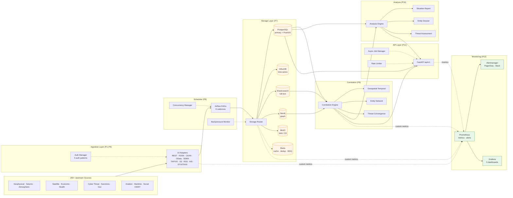
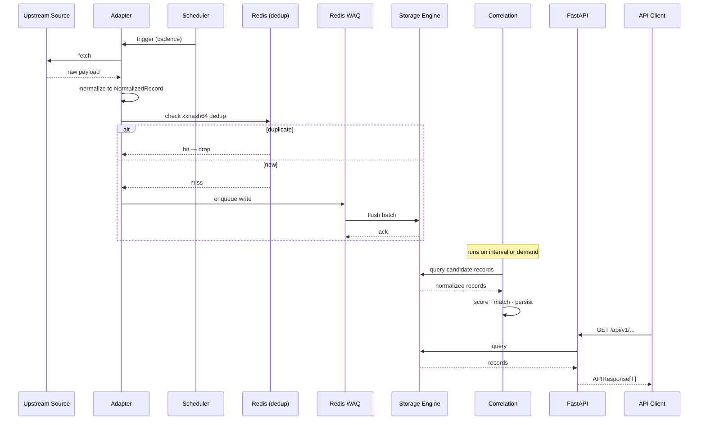
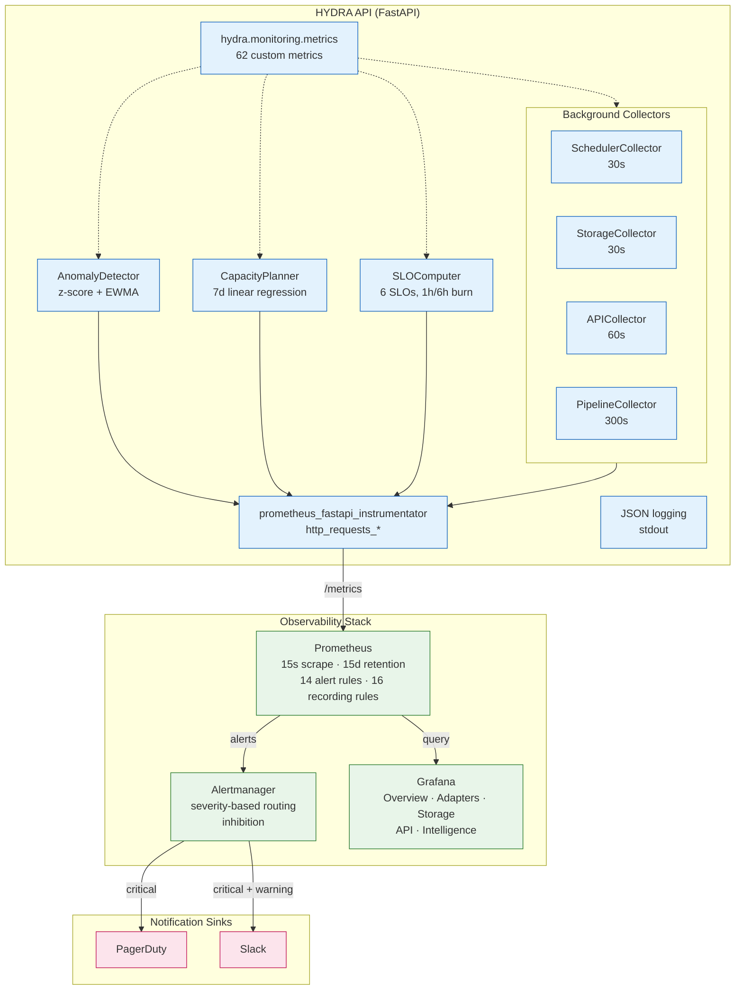

# HYDRA — OSINT Aggregation & Correlation Platform

HYDRA is a modular OSINT data ingestion, correlation, and visualization platform.
It aggregates 200+ data streams across 28 thematic tiers, the Tier 29 vulnerability
substrate, and the Mil-Int public-information surface (tiers 100–107) using 11
adapter types, normalizes all records to a universal schema, stores them across 6
storage engines, schedules ingestion via cadence-aware pipelines, correlates
cross-tier data for intelligence products, and exposes the whole thing via a REST
API with a full Prometheus + Grafana observability stack.

## Architecture



### Core Components

- **28 Thematic Tiers** — Geophysical, Atmospheric, Space Weather, Satellite Imagery,
  Economic, Law Enforcement, Public Health, International Orgs, Cyber Threat, Human
  Rights, Astronomy, Sanctions, and 16 more domains.
- **Tier 29 — Vulnerability Intelligence** — NVD CVE, FIRST EPSS, CISA KEV, ExploitDB,
  Metasploit modules.
- **Mil-Int Surface (tiers 100–107)** — 60+ public defense / intel document
  repositories (DTIC, NIST SP 800, DISA STIGs, NATO STO, FOI, NIDS, DRDO, ...).
- **11 Adapters** — REST/JSON, FDSN, CKAN, OData, SDMX, TAP/VO, S3 Bulk, Scrape/RSS,
  AIS/ADS-B, STIX/TAXII, doc_repo (document repositories).
- **6 Storage Engines** — PostgreSQL (primary), InfluxDB (time-series), Elasticsearch
  (full-text), Neo4j (graph), MinIO (blob), Redis (cache/dedup/WAQ).
- **3 Correlation Pipelines** — Geospatial-Temporal, Entity Network, Threat Convergence.
- **3 Intelligence Products** — Situation Report, Entity Dossier, Threat Assessment.
- **REST API** — FastAPI with cursor-based pagination, API-key auth, async jobs.
- **Observability** — Prometheus, Alertmanager, Grafana with 62 custom metrics,
  14 alert rules, 16 recording rules, 5 dashboards, SLO tracking, anomaly detection,
  and capacity forecasting.

## Data Flow



## Monitoring Architecture (P12)



### Metrics (62 custom + HTTP instrumentation)

| Subsystem | Count | Examples |
|---|---|---|
| Adapter | 9 | `hydra_adapter_fetch_total`, `hydra_adapter_dead_streams` |
| Scheduler | 5 | `hydra_scheduler_active_adapters`, `hydra_scheduler_sla_misses_total` |
| Storage | 9 | `hydra_storage_waq_depth`, `hydra_storage_dlq_depth` |
| Backpressure | 3 | `hydra_backpressure_state` (0=CLEAR, 1=THROTTLED, 2=BLOCKED) |
| API | 5 | `hydra_api_job_status`, `hydra_api_rate_limit_hits_total` |
| Product | 6 | `hydra_product_confidence_score` (histogram) |
| Correlation | 6 | `hydra_correlation_total`, `hydra_correlation_tier_pair_total` |
| Anomaly | 3 | `hydra_anomaly_flag{detector,pipeline_id}` |
| Capacity | 9 | `hydra_capacity_days_to_threshold{engine}` |
| SLO | 6 | `hydra_slo_error_budget_remaining{slo_name}` |

### Alerts

- **5 critical** (page immediately): Scheduler unreachable, primary storage down,
  backpressure blocked, DLQ > 500, API down.
- **2 SLO burn-rate** (fast + slow burn windows).
- **7 warning** (Slack only): adapter failure rate, job failures, API 5xx,
  rate-limit exhaustion, correlation-volume anomaly, confidence drift, capacity low.

## Mil-Int Public Information Surface

`mil_int_public_information` aggregates 60+ public defense, S&T, and national
security document repositories across 40+ nations. Eight registry tiers map onto
the LOOM intake spec:

| Tier | Group                        | Cadence    |
|------|------------------------------|------------|
| 100  | US Domestic Defense S&T      | weekly     |
| 101  | Five Eyes Partners           | biweekly   |
| 102  | NATO & European Allies       | biweekly   |
| 103  | Nordic Defense Research      | biweekly   |
| 104  | Asia-Pacific Defense         | monthly    |
| 105  | Russia / Adversary Monitoring| monthly    |
| 106  | Regional ME / AF / LATAM     | quarterly  |
| 107  | Access-Control Reference     | on_change  |

Surface module: `src/hydra/mil_int/` (settings, classification gate, mirror
dedup, standards xref engine, pluggable search backends, FastAPI routers).
API surface:

```
/api/v1/mil-int/manifest                  # list every source + access_policy
/api/v1/mil-int/search                    # full-text + faceted (POST)
/api/v1/mil-int/standards/xref            # MIL-STD ↔ NIST SP ↔ STANAG ↔ DEF STAN
/api/v1/mil-int/standards/families        # recognised families
/api/v1/mil-int/doctrine/sources          # curated Tier 105 stream
/api/v1/mil-int/compliance/sources        # STIG + NIST SP 800 + NSA CSI overlay
```

The surface is **UNCLASSIFIED-only** — `hydra.mil_int.classification` rejects
any record carrying classification markers and increments
`hydra_mil_int_access_policy_violations_total`. Subscription / restricted /
archived / monitor-only sources are registered for visibility but never
auto-fetched (see `specs/mil-int-surface/source_manifest.md`).

See `specs/mil-int-surface/{requirements,design,tasks}.md` for full details.

## Quick Start

```bash
docker-compose up -d
```

This starts:
- `api` — HYDRA REST API on port **8000**
- `postgres`, `influxdb`, `elasticsearch`, `neo4j`, `minio`, `redis` — storage layer
- `prometheus` on port **9090** — metrics scraping (15s interval, 15d retention)
- `alertmanager` on port **9093** — alert routing
- `grafana` on port **3000** — dashboards (default admin/admin, override with `GRAFANA_ADMIN_PASSWORD`)

### Production setup

Before deploying:
1. Set `SLACK_WEBHOOK_URL` and `PAGERDUTY_ROUTING_KEY` in `alertmanager/alertmanager.yml`
2. Override `GRAFANA_ADMIN_PASSWORD` via env
3. Run migrations: `alembic upgrade head`
4. Create at least one API key: `python scripts/create_api_key.py`

## Development Setup

```bash
# Create virtual environment
python -m venv .venv
source .venv/bin/activate   # macOS / Linux
# OR: .venv\Scripts\activate   # Windows

# Install with dev dependencies
pip install -e ".[dev]"

# Run tests
pytest

# Lint
ruff check src/ tests/
```

### Running the monitoring test suite

```bash
pytest tests/test_metrics.py tests/test_collectors.py tests/test_slo.py \
       tests/test_anomaly.py tests/test_capacity.py tests/test_alerts.py \
       tests/test_logging.py -v
```

Hypothesis property-based tests run alongside unit tests — 14 properties cover
metric naming, collector error isolation, SLO math, anomaly detection guards,
growth projection correctness, alert rule metric validity, and recording rule
consistency.

## Directory Structure

```
src/hydra/
├── config.py              # Pydantic-settings configuration
├── models/                # NormalizedRecord and shared data models
├── registry/              # Stream registry (YAML + typed loader)
├── utils/                 # Hashing, geo utilities
├── adapters/              # 10 ingestion adapters (P1-P5)
├── auth/                  # Authentication layer (P6)
├── storage/               # Storage engines and routing (P7)
├── scheduler/             # Airflow DAG generation (P8)
├── correlation/           # Cross-tier correlation (P9)
├── analysis/              # Intelligence products (P10)
├── api/                   # FastAPI REST API (P11)
├── mil_int/               # Mil-Int public-information surface (tiers 100-107)
└── monitoring/            # Observability layer (P12)
    ├── metrics.py         # 62 custom Prometheus metrics
    ├── collectors/        # Background metric collectors
    ├── anomaly.py         # Statistical anomaly detection
    ├── capacity.py        # Storage growth forecasting
    ├── slo.py             # SLO / error-budget computation
    ├── instrumentator.py  # FastAPI HTTP instrumentation
    └── log_config.py      # Structured JSON logging

prometheus/                # Scrape config, alert rules, recording rules
alertmanager/              # Alert routing config
grafana/                   # Datasource + dashboard provisioning
alembic/                   # Database migrations
dags/                      # Airflow DAG definitions
```

## Configuration

All settings are under the `HYDRA_` environment variable prefix with `__` as the
nested delimiter. Examples:

```bash
HYDRA_DATABASE__POSTGRES_DSN=postgresql+asyncpg://user:pw@host/db
HYDRA_API__CORS_ORIGINS='["http://localhost:3000"]'
HYDRA_MONITORING__LOG_FORMAT=json
HYDRA_MONITORING__ANOMALY_ZSCORE_THRESHOLD=3.0
HYDRA_MONITORING__SLO_ADAPTER_SUCCESS_TARGET=0.995
HYDRA_MONITORING__CAPACITY_PG_THRESHOLD_BYTES=107374182400
```

Defaults live in `config/settings.yaml` and the Pydantic settings classes in
`src/hydra/config.py`.

## License

Proprietary — All rights reserved.
