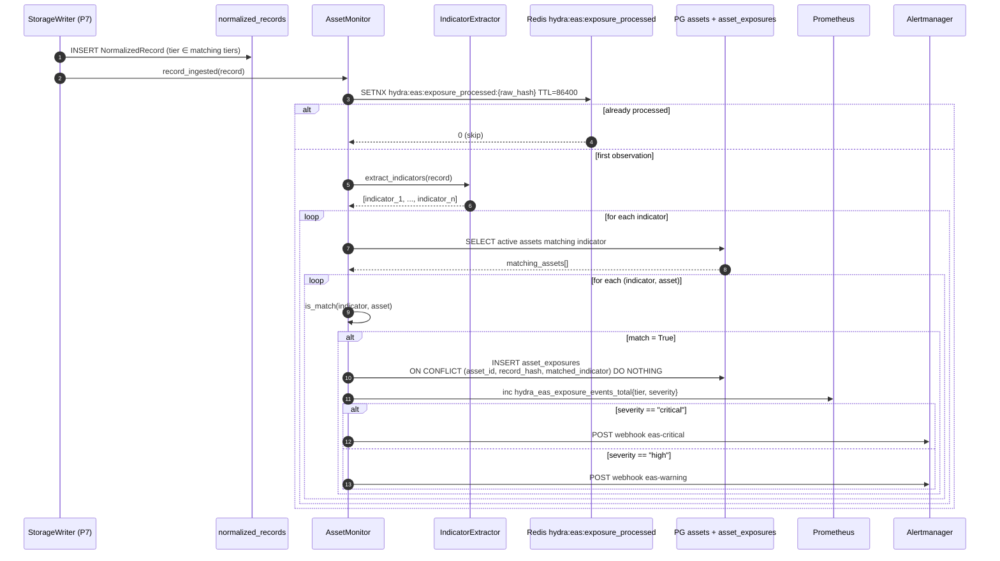
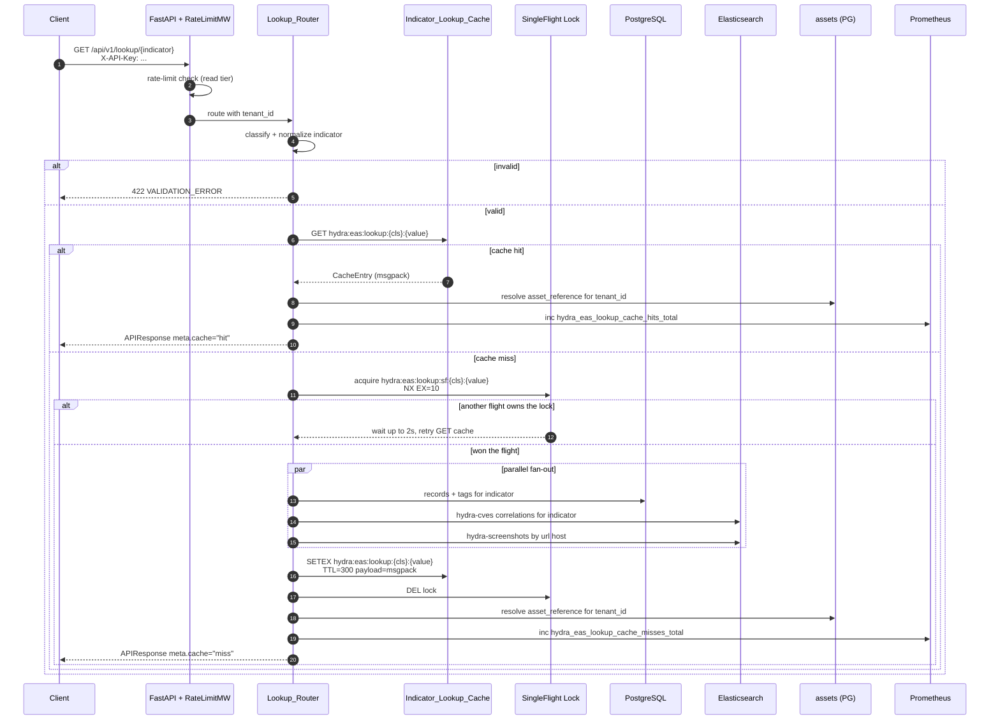
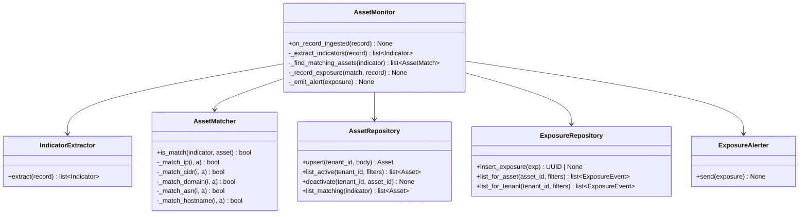
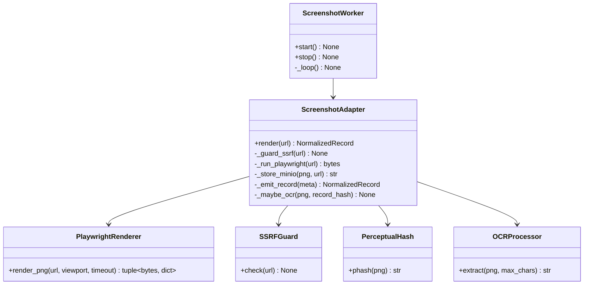
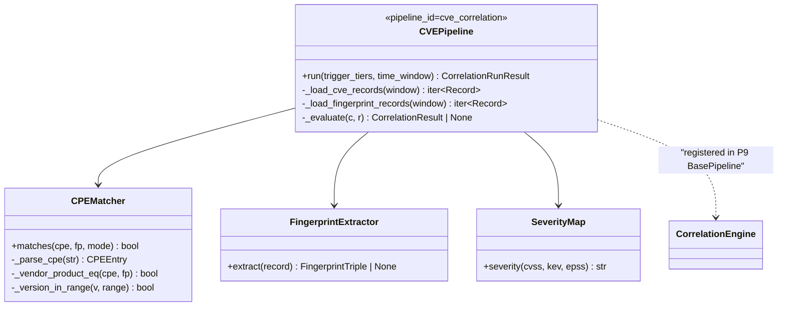
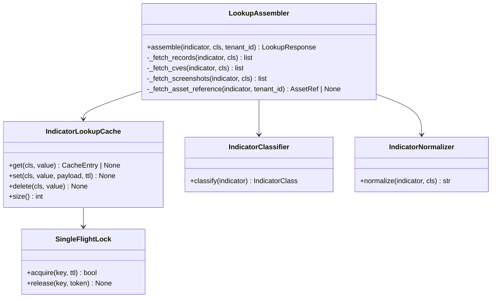
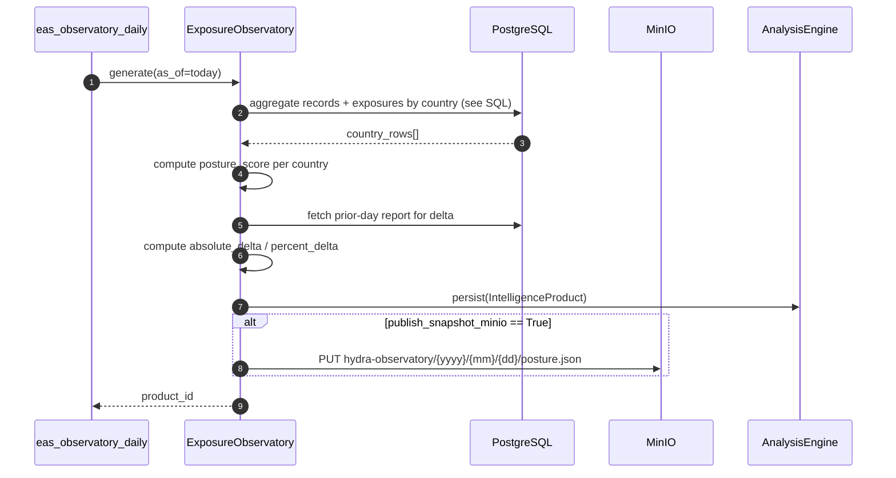

# P13 — Extended Access Services (EAS) Design

## Specification — HYDRA OSINT Platform
**Version:** 0.1.0
**Phase:** 13 (MVP)
**Depends on:** P0 (Shared Contracts), P7 (Storage), P8 (Scheduler), P9 (Correlation), P10 (Analysis), P11 (API), P12 (Monitoring)
**Consumed by:** External tenants, downstream SIEM/TIP platforms, HYDRA web UI (post-MVP)
**Produces:** `src/hydra/eas/**`, nine new routers, one Alembic migration pack, one Airflow DAG, new Elasticsearch mappings, one alert-rule file, one Grafana dashboard.

---

## 1. Overview

Extended Access Services (EAS) is a cohesive Phase 13 module that layers seven consumer-facing capabilities on top of the existing HYDRA platform:

| # | Capability | Router | Backed by |
|---|---|---|---|
| 1 | Asset Exposure Monitoring | `/api/v1/assets` | AssetMonitor, PG `assets`, PG `asset_exposures` |
| 2 | Visual / Screenshot Intelligence | `/api/v1/images` | Screenshot_Adapter, MinIO, ES `hydra-screenshots` |
| 3 | CVE & Exploit Enrichment | `/api/v1/cves`, `/api/v1/exploits` | CVE_Pipeline (P9 pipeline #4), ES `hydra-cves` |
| 4 | Geospatial Exploration | `/api/v1/maps` | Tile_Aggregator (H3/geohash), PostGIS |
| 5 | Historical Trends | `/api/v1/trends`, `/api/v1/jobs` | InfluxDB, PG fallback, extended JobManager |
| 6 | Fast Indicator Lookup | `/api/v1/lookup` | Indicator_Lookup_Cache (Redis), PG, ES |
| 7 | Exposure Observatory | `/api/v1/observatory` | ExposureObservatory (P10 product #4), MinIO |

EAS does not replace any existing primitive. It extends the `Tier` enum with `VULNERABILITY_INTELLIGENCE = 29`, adds a fourth correlation pipeline (`cve_correlation`), adds a fourth intelligence product (`exposure_posture_report`), adds a fourth rate-limit tier (`expensive`), and adds a `tenant_id` column to `api_keys`. All routers mount under the existing FastAPI app's `/api/v1` prefix and reuse the `APIResponse[T]` envelope, cursor pagination, `JobManager`, and `X-API-Key` authentication from P11.

The design is organized around four principles:

1. **Tenant isolation by construction** — every asset, exposure, and cache key is namespaced by `tenant_id`, enforced at the query layer and never at the application layer alone.
2. **Read-through caching for hot paths** — the lookup endpoint targets p95 ≤ 100 ms (R17.4) by serving all repeated queries from a Redis LRU cache; cold-path logic is consolidated in a single `assemble_lookup_payload` coroutine behind a single-flight lock.
3. **Deterministic matching** — asset matching (AssetMonitor) and CVE-to-fingerprint matching (CVE_Pipeline) are pure functions over `(record, asset)` or `(C, R)` pairs so that re-running the pipeline on the same inputs produces bit-identical outputs (R3 property, R10.5, R27.7).
4. **Cost containment** — the `expensive` rate-limit tier plus per-tenant daily quota counters in Redis bound the cost of screenshot captures, observatory regenerations, and CVE correlations per R21 and R22.

---

## 2. Architecture

### 2.1 High-Level Component Diagram

```mermaid
graph TB
  subgraph ingest[Existing Ingest Path P1-P8]
    ADAPTERS[Adapters T1-T29]
    WRITER[StorageWriter / WAQ]
    NR[(normalized_records<br/>PG + PostGIS)]
    ADAPTERS --> WRITER --> NR
  end

  subgraph eas[EAS Module src/hydra/eas]
    AM[AssetMonitor]
    SA[Screenshot_Adapter<br/>new adapter_type]
    CP[CVE_Pipeline<br/>P9 pipeline #4]
    TA[Tile_Aggregator]
    ILC[Indicator_Lookup_Cache]
    EO[ExposureObservatory<br/>P10 product #4]
    JMX[JobManager+Progress]
  end

  subgraph routers[EAS Routers /api/v1]
    R_ASSETS[assets]
    R_IMAGES[images]
    R_CVES[cves]
    R_EXPLOITS[exploits]
    R_MAPS[maps]
    R_TRENDS[trends]
    R_JOBS[jobs]
    R_LOOKUP[lookup]
    R_OBS[observatory]
  end

  subgraph storage[P7 Storage Engines]
    PG[(PostgreSQL<br/>assets, asset_exposures,<br/>api_keys.tenant_id)]
    REDIS[(Redis<br/>lookup cache, job state,<br/>cost quota)]
    ES[(Elasticsearch<br/>hydra-screenshots,<br/>hydra-cves)]
    INFLUX[(InfluxDB)]
    MINIO[(MinIO<br/>hydra-screenshots,<br/>hydra-observatory)]
    NEO4J[(Neo4j)]
  end

  subgraph cross[Cross-cutting]
    P11AUTH[get_current_api_key +<br/>tenant_id]
    P12METRICS[Prometheus + Alertmanager]
    P9ENG[CorrelationEngine]
    P10ENG[AnalysisEngine]
    P8DAG[DAG Factory]
  end

  WRITER -. "on write" .-> AM
  AM --> PG
  AM -. "critical" .-> P12METRICS
  SA --> MINIO
  SA --> ES
  SA --> NR
  CP -. "registered with" .-> P9ENG
  CP --> PG
  CP -. "asset hit" .-> AM
  EO -. "registered with" .-> P10ENG
  EO --> PG
  EO --> MINIO

  R_ASSETS --> AM
  R_ASSETS --> PG
  R_IMAGES --> ES
  R_IMAGES --> MINIO
  R_CVES --> ES
  R_CVES --> PG
  R_EXPLOITS --> ES
  R_MAPS --> TA --> PG
  R_TRENDS --> INFLUX
  R_TRENDS -. "fallback" .-> PG
  R_JOBS --> JMX --> REDIS
  R_LOOKUP --> ILC --> REDIS
  ILC -. "miss" .-> PG
  ILC -. "miss" .-> ES
  R_OBS --> EO
  R_OBS --> P10ENG

  routers --> P11AUTH
  eas -. "metrics" .-> P12METRICS
  P8DAG -. "daily DAG" .-> EO
```



### 2.2 Request-Flow Sequence: Exposure Matching (R3, R5)

Satisfies R3.1–R3.5 and R5.1–R5.4. Flow is triggered by every write to `normalized_records` for tiers in `EASSettings.exposure_matching_tiers`.



### 2.3 Request-Flow Sequence: `/api/v1/lookup/{indicator}` Cache-First Read (R16, R17)

Satisfies R16.1–R16.4, R17.1–R17.6, R27.8 (tenant-isolation invariant).



### 2.4 Module Layout

```
src/hydra/eas/
├── __init__.py                        # exports setup_eas(app, settings)
├── settings.py                        # EASSettings Pydantic model (see §8)
├── setup.py                           # setup_eas() — mounts routers, wires singletons
│
├── assets/
│   ├── __init__.py
│   ├── models.py                      # Asset, Exposure_Event dataclasses
│   ├── normalizer.py                  # normalize_asset_value() per asset_type
│   ├── monitor.py                     # AssetMonitor (§8.1)
│   ├── extractor.py                   # IndicatorExtractor — pulls indicators from payload
│   ├── matcher.py                     # is_match(indicator, asset) — per asset_type
│   ├── alerter.py                     # ExposureAlerter — Alertmanager webhook
│   └── repository.py                  # AssetRepository — PG CRUD
│
├── screenshots/
│   ├── __init__.py
│   ├── adapter.py                     # Screenshot_Adapter
│   ├── renderer.py                    # Playwright wrapper
│   ├── ocr.py                         # Tesseract integration (optional)
│   ├── phash.py                       # Perceptual-hash helpers, Hamming_Similarity
│   ├── ssrf_guard.py                  # private-IP + DNS rebinding protection
│   └── repository.py                  # ES + MinIO read helpers
│
├── cves/
│   ├── __init__.py
│   ├── pipeline.py                    # CVE_Pipeline (P9 pipeline #4)
│   ├── cpe_matcher.py                 # CPEMatch algorithm
│   ├── fingerprint.py                 # fingerprint extraction per tier
│   ├── severity.py                    # severity map
│   └── repository.py                  # ES + PG query helpers
│
├── maps/
│   ├── __init__.py
│   ├── tile_aggregator.py             # Tile_Aggregator
│   ├── h3_cells.py                    # H3 resolution mapping
│   ├── geohash_cells.py               # geohash precision mapping
│   └── repository.py                  # PostGIS bbox queries
│
├── trends/
│   ├── __init__.py
│   ├── service.py                     # TrendsService — influx + PG fallback
│   ├── buckets.py                     # bucket-size validation, window ceilings
│   └── comparison.py                  # previous-period delta computation
│
├── lookup/
│   ├── __init__.py
│   ├── classifier.py                  # indicator_classifier()
│   ├── normalizer.py                  # indicator normalization
│   ├── cache.py                       # Indicator_Lookup_Cache (§8.5)
│   ├── assembler.py                   # assemble_lookup_payload()
│   └── singleflight.py                # dogpile lock for cache stampede
│
├── observatory/
│   ├── __init__.py
│   ├── generator.py                   # ExposureObservatory (P10 product #4)
│   ├── posture.py                     # posture_score() formula
│   ├── country.py                     # ISO 3166-1 alpha-2 extraction
│   └── repository.py                  # aggregation SQL
│
├── jobs/
│   ├── __init__.py
│   └── progress.py                    # JobManager progress-tracking extensions (§8.7)
│
├── quota/
│   ├── __init__.py
│   └── counter.py                     # CostQuotaCounter — per-tenant daily counters
│
├── storage/
│   ├── __init__.py
│   ├── es_mappings.py                 # hydra-screenshots, hydra-cves index mappings
│   └── repositories.py                # shared read-side repositories
│
├── routers/
│   ├── __init__.py
│   ├── assets.py
│   ├── images.py
│   ├── cves.py
│   ├── exploits.py
│   ├── maps.py
│   ├── trends.py
│   ├── jobs.py
│   ├── lookup.py
│   └── observatory.py
│
├── schemas/
│   ├── __init__.py
│   ├── assets.py                      # AssetCreate, AssetResponse, ExposureResponse
│   ├── images.py                      # ImageMetadataResponse, ImageSearchResult
│   ├── cves.py                        # CVEDetailResponse, CVESearchResult, ExploitSearchResult
│   ├── maps.py                        # FeatureCollectionResponse, TileCellResponse
│   ├── trends.py                      # TrendRequest, TrendResponse, JobProgressResponse
│   ├── lookup.py                      # LookupResponse
│   └── observatory.py                 # ExposurePostureReportResponse, CountryPostureResponse
│
└── dependencies.py                    # get_current_tenant_id, get_eas_settings

alembic/versions/
├── eas_001_vulnerability_tier.py
├── eas_002_api_keys_tenant_id.py
├── eas_003_assets_tables.py
└── eas_004_asset_exposures_indexes.py

dags/
└── eas_observatory_daily.py

prometheus/rules/
└── hydra_eas_alerts.yml

grafana/dashboards/
└── hydra_eas.json

tests/eas/
├── conftest.py
├── test_assets.py
├── test_exposure_matching.py          # + property tests
├── test_screenshots.py
├── test_phash_similarity.py           # property tests
├── test_cves.py
├── test_cve_pipeline.py               # property tests
├── test_maps.py
├── test_tile_aggregator.py            # property tests
├── test_trends.py                     # property tests
├── test_lookup.py
├── test_lookup_tenant_isolation.py    # property tests
├── test_observatory.py
├── test_jobs_progress.py              # property tests
└── test_pagination_roundtrip.py       # property tests
```

---

## 3. Design Decisions

Architectural choices resolved from the requirements-first phase. Numbered to match the required subsection style of P11 §2 and P12 §2.

### 3.1 Tenant Identity Strategy (R20)

Tenants are represented by a `tenant_id UUID NOT NULL` column added to the existing `api_keys` table. A tenant is defined as "the set of API keys sharing a `tenant_id` value". No tenant-lookup table is introduced — the `tenant_id` column is self-describing and avoids an extra join on every authenticated request.

**Provisioning.** New API keys are created with `python scripts/create_api_key.py --name <name> --tenant-id <uuid>` (extended in P13). When `--tenant-id` is omitted, the CLI generates a fresh UUID4 and prints it alongside the raw key.

**Backfill for existing keys.** The Alembic migration `eas_002_api_keys_tenant_id.py` adds the column as nullable first, runs a data-migration step that assigns one fresh UUID4 per distinct `name` prefix (treating `name` as `{tenant_slug}-{keyname}`; when `name` does not follow that convention, the key gets its own tenant), then alters the column to `NOT NULL`. The migration is reversible — `downgrade()` drops the column unconditionally because tenant IDs assigned in P13 have no semantic predecessor.

**Propagation.** The P11 `get_current_api_key` dependency is extended to load `tenant_id` into `APIKeyRecord`. A new `get_current_tenant_id` convenience dependency returns only the UUID, so EAS routers that need just the tenant context can depend on it without coupling to the full record. Satisfies R20.2.

**Enforcement in DB queries.** Every query that reads a `tenant_id`-bearing row adds `WHERE tenant_id = :tenant_id` as a mandatory predicate. This is enforced at the repository layer (`AssetRepository.list`, `.get`, `.delete`) — not at the router layer — so that a router mistake cannot leak data. The 404 response for cross-tenant access (R2.4, R20.4) is produced because the predicate makes the row invisible, not because the router checks tenant ID after fetching.

**CVE, Exploit, Maps, Trends, Observatory are tenant-agnostic** for reads, per R20.5. Write paths that mutate tenant-scoped counters (cost quotas) do read `tenant_id`.

### 3.2 Asset Indicator-Matching Strategy (R1, R3)

`AssetMonitor.is_match(indicator, asset)` is a pure function over the asset's `normalized_value` and the indicator string. The algorithm is selected by `asset.asset_type`:

| asset_type | Matching semantics | Implementation |
|---|---|---|
| `ip` | exact equality of compressed IP | `ipaddress.ip_address(indicator) == ipaddress.ip_address(asset.normalized_value)` |
| `cidr` | containment | `ipaddress.ip_address(indicator) in ipaddress.ip_network(asset.normalized_value)` |
| `domain` | suffix match (eTLD+1 and below) | `indicator == asset.normalized_value` OR `indicator.endswith("." + asset.normalized_value)` |
| `hostname` | exact equality (case-insensitive ASCII) | `indicator.lower() == asset.normalized_value.lower()` |
| `asn` | equality after stripping `AS` prefix | `_asn_of(indicator) == int(asset.normalized_value.removeprefix("AS"))` |

**ASN lookup.** The ASN path requires mapping an IP to its origin ASN. The design uses an in-process `pyasn`-backed lookup seeded from the MaxMind GeoLite2-ASN dataset, refreshed weekly via a cron DAG (reusing the existing P8 DAG factory). The file path is configurable via `EASSettings.asn_database_path`. The lookup table is loaded once at process start and held in memory (≈8 MB). If the database is unavailable, `is_match` for `asn`-type assets returns `False` and emits `hydra_eas_asn_lookup_failure_total`.

**Determinism (R3 PBT property).** Because `is_match` consumes only `(indicator, asset.normalized_value)` and reads the ASN DB as a bounded, deterministic mapping, two invocations on identical inputs produce identical booleans. The ASN DB is versioned by filename hash so that tests can pin a specific version.

### 3.3 Screenshot Trigger Source and Concurrency (R6)

**Trigger source.** URLs for screenshot capture come from three sources, resolved in priority order:

1. **Explicit tenant request** — `POST /api/v1/assets/{asset_id}/screenshot?url=...` (expensive rate-limit tier, R21.2).
2. **Automatic from asset exposures** — when `AssetMonitor` writes an `asset_exposure` for a record whose payload contains a URL with `scheme in {http, https}` and an active asset flag `capture_screenshots = true`, the adapter is enqueued to the `screenshot` task queue.
3. **Scheduled sweeps** — a daily DAG (part of the existing P8 cadence framework, not a new cadence) iterates active assets with `capture_screenshots = true` and enqueues their canonical URL for rendering.

**Task queue.** A Redis list `hydra:eas:screenshot:queue` acts as the work queue. Workers are asyncio coroutines started by `setup_eas()` with concurrency bounded by `EASSettings.screenshot.max_concurrency` (default 4). Each worker pops one URL, acquires a per-host semaphore (`EASSettings.screenshot.per_host_concurrency`, default 1) to avoid hammering a single origin, and runs the Playwright render.

**Playwright sandboxing.** Chromium launches with `--no-sandbox --disable-dev-shm-usage --disable-gpu` inside the existing container. Requests go through an egress allow-list proxy (see §13 Security) so that private IPs and DNS-rebinding attacks are blocked at the network layer, not just in-process.

**Backpressure.** Each worker calls `BackpressureMonitor.check("minio")` before render (R6.4). If state is `BLOCKED`, the worker re-pushes the URL to the queue with a 30-second delay and exits the loop iteration.

### 3.4 CVE Correlation Matching Semantics (R10)

The CVE_Pipeline joins `NormalizedRecord` with `tier == 29 AND source == "nvd"` against fingerprint records from tiers 16, 17, and 28.

**CPE match.** A CPE is represented as `cpe:2.3:<part>:<vendor>:<product>:<version>:<update>:<edition>:<lang>:<sw_edition>:<target_sw>:<target_hw>:<other>`. The pipeline treats `affected_cpes` from the NVD payload as a list of CPE 2.3 strings. The extracted fingerprint is a triple `(vendor, product, version)` parsed from `R.payload.fingerprint` via `EASSettings.cve_fingerprint_map`.

**Matching modes.** Two match modes are supported, selectable via `EASSettings.cve_match_mode`:

| Mode | Semantics |
|---|---|
| `loose` (default) | Case-insensitive match of `(vendor, product)`; version ignored |
| `strict` | Case-insensitive match of `(vendor, product)` AND version satisfies the NVD `versionStartIncluding`/`versionEndExcluding` ranges |

Loose mode is default because many OSINT fingerprint records lack reliable version data; strict mode is available for tenants that want fewer false positives. Pseudo-Python:

```python
def cpe_matches(cpe_entry: CPEEntry, fp: FingerprintTriple, mode: str) -> bool:
    if cpe_entry.vendor.lower() != fp.vendor.lower():
        return False
    if cpe_entry.product.lower() != fp.product.lower():
        return False
    if mode == "loose":
        return True
    if fp.version is None:
        return False
    return cpe_entry.version_range.contains(fp.version)  # uses packaging.version
```

**Confidence formula.** Per R10.3:

```
confidence = min(1.0, 0.5 + 0.1 * cvss_v3_score)
```

With tie-breakers when multiple (C, R) pairs produce the same confidence — pairs are sorted by `(cvss_v3_score DESC, kev_listed DESC, epss_score DESC, C.raw_hash ASC)` so that the persisted ordering is deterministic.

**KEV and EPSS contribution.** KEV and EPSS influence `evidence` but not `confidence` (keeping R10.3 math unchanged). They do affect `severity` when the match is fed to `AssetMonitor.record_exposure_from_correlation`:

| Condition | Severity |
|---|---|
| `kev_listed AND cvss >= 9.0` | `critical` |
| `kev_listed OR (cvss >= 7.0 AND epss >= 0.7)` | `high` |
| `cvss >= 7.0` | `medium` |
| otherwise | `low` |

### 3.5 Maps Tile Aggregation Choice (R13)

**Default strategy: H3.** H3 is the default (`EASSettings.maps_aggregation_strategy = "h3"`) because:

1. H3 cells are approximately equal-area, which gives visually stable density maps.
2. The `h3` Python library provides `latlng_to_cell`, `cell_to_boundary`, and `cell_to_parent` in constant time.
3. Parent/child relationships satisfy the count-conservation property (R13.3): `sum(cell.count)` at zoom `z1` is preserved at zoom `z2 > z1` when each child cell's count rolls up to its parent.

`geohash` remains available for legacy compatibility and for clients that need a string-prefix hierarchy.

**Zoom → resolution mapping.**

| zoom | H3 resolution | Geohash precision |
|---|---|---|
| 0–2 | 0 | 1 |
| 3–4 | 1 | 2 |
| 5–6 | 3 | 3 |
| 7–8 | 5 | 4 |
| 9–10 | 7 | 5 |
| 11–12 | 8 | 6 |
| 13–14 | 9 | 7 |
| 15–16 | 10 | 8 |
| 17–18 | 11 | 9 |

The table satisfies R13.2 (monotonicity: `precision(zoom+1) ≥ precision(zoom)` and differences are in `{0, 1}`).

**Truncation (R13.4).** When the number of non-empty cells exceeds `maps_tile_max_cells` (default 2000), the response includes only the top-N cells by `count DESC`, ties broken by `cell_id ASC`. The response meta includes `truncated: true` and `total_cells: <count>` so clients can warn users or request a higher zoom. Truncation preserves the R13.3 property up to the truncation limit.

### 3.6 Trends Fallback and Bucket Ceilings (R14)

**Fallback.** When `StorageHealth("influxdb").status == UNREACHABLE`, the Trends_Router executes an equivalent PostgreSQL aggregation using `time_bucket` from TimescaleDB (already enabled in the PG schema) or plain `date_trunc` when TimescaleDB is absent. The fallback response carries `meta.fallback = true` and returns `207 Multi-Status` per R14.5.

**Bucket ceilings.** A bucket is valid only when the implied point count per series stays under a safety ceiling. Window/bucket combinations are validated in the router before hitting the storage layer:

| Bucket | Max window | Point cap per series |
|---|---|---|
| `1m` | 14 days | 20 160 |
| `5m` | 60 days | 17 280 |
| `15m` | 120 days | 11 520 |
| `1h` | 365 days | 8 760 |
| `6h` | 730 days | 2 920 |
| `1d` | 1825 days | 1 825 |
| `7d` | 3650 days | 521 |

Requests exceeding the ceiling return `422 WINDOW_TOO_LARGE` (R14.3). The `trends_max_window_days` setting acts as a hard ceiling across all buckets (default 365).

### 3.7 Lookup Cache Key Format, TTL, and Stampede Protection (R17)

**Key format.** `hydra:eas:lookup:{indicator_class}:{normalized_value}`. The `indicator_class` prefix prevents collisions between, e.g., a hostname `"10.0.0.1"` (if someone registered such a hostname) and an IPv4 value `10.0.0.1`.

**Serialization.** Payloads are stored as msgpack. msgpack is chosen over JSON because:

1. It encodes `datetime` and `UUID` natively via extension codes (via `msgpack-python` + `ormsgpack` encoders).
2. It is roughly 40–60 % smaller than JSON for the typical `LookupResponse` shape (many repeated keys), saving Redis memory when the cache is at its 100 000-entry ceiling.

Cache hits re-encode to JSON for the HTTP response so that client APIs remain identical.

**TTL.** Fixed TTL of `EASSettings.lookup_cache_ttl_seconds` (default 300 seconds). A shorter TTL (e.g., 30 s) was considered but rejected: the underlying `records`, `correlation_results`, and `screenshots` rows do not change rapidly enough to justify the higher miss rate.

**Stampede (dogpile) protection.** A single-flight lock per key prevents N concurrent cache-miss clients from all hitting PG simultaneously:

1. On miss, attempt `SET hydra:eas:lookup:sf:{cls}:{value} <req_id> NX EX 10`.
2. If `SET` succeeds, proceed to assemble the payload, write the cache, then `DEL` the lock.
3. If `SET` fails (another flight is in progress), poll `GET hydra:eas:lookup:{cls}:{value}` every 50 ms for up to 2 seconds.
4. If still no cached value after the poll window, fall through to the normal (uncached) assembly path. This is a safety valve — under normal operation the first flight finishes within 2 s.

**Eviction (R17.3).** The `hydra:eas:lookup:*` namespace is held in a dedicated Redis database (`EASSettings.lookup_cache_redis_db`, default 3) configured at Redis start-up with `maxmemory-policy allkeys-lru` and `maxmemory` sized to hold 100 000 typical entries (~2 GB at ~20 KB/entry in msgpack).

### 3.8 Observatory Posture Score and Country-Code Extraction (R18)

**Country-code extraction.** The ExposureObservatory aggregates by ISO 3166-1 alpha-2 code. Extraction precedence:

1. `record.payload.country_code` if present and length 2.
2. Reverse-geocoding on `record.geo.coordinates` using the `countries` shapefile loaded at process start (same dataset used by geospatial-temporal correlation in P9).
3. `record.payload.country` mapped to alpha-2 via a static `pycountry` lookup.
4. If none of the above yields a value, the record is excluded from per-country aggregation and counted toward `unknown_region_records` in the report's `overview` section.

**Posture score formula.** Per R18.3, the score is in `[0, 100]`, higher = worse. It is computed per country as a weighted linear combination, then clipped. Weights come from `EASSettings.posture_score_weights`:

```
score_raw = (w_kev * kev_exposures_normalized
           + w_crit * critical_exposures_normalized
           + w_vuln_density * vuln_density_normalized
           + w_stale * stale_patch_ratio
           + w_asset_surface * exposed_asset_surface_normalized)
score = max(0.0, min(100.0, 100.0 * score_raw))
```

where:

| Component | Formula | Default weight |
|---|---|---|
| `kev_exposures_normalized` | `clip(kev_count / 50, 0, 1)` | `w_kev = 0.30` |
| `critical_exposures_normalized` | `clip(critical_count / 200, 0, 1)` | `w_crit = 0.25` |
| `vuln_density_normalized` | `clip(vuln_cves_per_asset / 5, 0, 1)` | `w_vuln_density = 0.20` |
| `stale_patch_ratio` | `cves_over_30_days_old / max(1, total_cves)` | `w_stale = 0.15` |
| `exposed_asset_surface_normalized` | `clip(distinct_exposed_hosts / 1000, 0, 1)` | `w_asset_surface = 0.10` |

The weights sum to 1.0 by construction; weight validation runs at settings load time. Satisfies R18.3 and R19 property (score determinism) because all inputs are deterministic joins on `normalized_records`, `correlation_results`, and `asset_exposures`.

**Trend delta (R18.4).** `absolute_delta = current_score - prior_score` (clipped to `[-100, 100]` by construction since both scores are already in `[0, 100]`). `percent_delta = 100.0 * absolute_delta / max(0.01, prior_score)` to avoid division by zero.

### 3.9 Rate-Limit `expensive` Tier and Cost Quota (R21, R22)

**`expensive` tier defaults.** The P11 `Rate_Tier` enum is extended with `expensive = 4`. Default limits `2 req/min` with burst `1`, configurable via `HYDRA__API__RATE_LIMIT_EXPENSIVE` and `HYDRA__API__RATE_LIMIT_EXPENSIVE_BURST`. Token-bucket algorithm reuses P11's Redis implementation; only the tier lookup table in `RateLimitMiddleware` changes.

**Endpoint-to-tier mapping** (adds to the P11 table):

| Endpoint | Tier |
|---|---|
| `POST /api/v1/assets` | write |
| `GET /api/v1/assets`, `/api/v1/assets/{id}`, `/api/v1/assets/{id}/exposures`, `/api/v1/exposures` | read |
| `DELETE /api/v1/assets/{id}` | write |
| `POST /api/v1/assets/{asset_id}/screenshot` | **expensive** |
| `GET /api/v1/images/{record_hash}`, `/api/v1/images/search` | read |
| `GET /api/v1/cves/*`, `/api/v1/exploits/*` | read |
| `POST /api/v1/cves/correlate` | **expensive** |
| `GET /api/v1/maps/features` | search |
| `GET /api/v1/trends` | search |
| `GET /api/v1/jobs/{id}/progress` | read |
| `GET /api/v1/lookup/{indicator}` | read |
| `GET /api/v1/observatory/*` | read |
| `POST /api/v1/observatory/generate` | **expensive** |

**Cost-quota accounting transactional model.** Counters are held in Redis keyed by `hydra:eas:cost:{tenant_id}:{quota_name}:{yyyymmdd}`. Each expensive operation uses a two-step atomic transaction:

1. `INCR` the counter. If the returned value is 1, `EXPIRE` it to 172 800 seconds (48 hours, per R22.3).
2. Compare against the configured quota. If over, `DECR` (undo) and return `429 COST_QUOTA_EXCEEDED`.

Both steps run in a single `MULTI/EXEC` pipeline so that concurrent requests cannot double-count. The INCR-DECR-reject pattern is used instead of `INCR-then-check-then-DECR` to guarantee atomicity: the decrement is part of the same pipeline, so a crash between steps cannot leave the counter over-counted (the crash would leave the counter incremented but the request would have failed anyway, which is the correct outcome — the counter will reset at UTC midnight TTL expiry). The tracked metric `hydra_eas_quota_usage_ratio{tenant_id, quota_name}` is updated by the same pipeline step.

---

## 4. Data Models

### 4.1 Pydantic v2 Schemas — Overview

All EAS API schemas live under `src/hydra/eas/schemas/`. Each file exports both the request and response models for a single router. Internal dataclasses (used between subsystems) live under the matching feature package (`src/hydra/eas/assets/models.py`, etc.).

### 4.2 `schemas/assets.py`

```python
from __future__ import annotations

import ipaddress
import re
from datetime import datetime
from enum import Enum
from typing import Any, Literal
from uuid import UUID

from pydantic import BaseModel, Field, field_validator, model_validator

# RFC 1035 hostname / domain — labels 1..63 chars, total <= 253
_DOMAIN_RE = re.compile(
    r"^(?=.{1,253}$)(?!-)([A-Za-z0-9-]{1,63}(?<!-)\.)+[A-Za-z]{2,63}$"
)


class AssetType(str, Enum):
    IP = "ip"
    CIDR = "cidr"
    DOMAIN = "domain"
    ASN = "asn"
    HOSTNAME = "hostname"


class ExposureSeverity(str, Enum):
    LOW = "low"
    MEDIUM = "medium"
    HIGH = "high"
    CRITICAL = "critical"


class AssetCreate(BaseModel):
    """POST /api/v1/assets request body."""

    asset_type: AssetType
    value: str = Field(..., min_length=1, max_length=253, examples=["192.0.2.0/24"])
    capture_screenshots: bool = Field(
        default=False,
        description="When True, automatic screenshot captures fire on exposure.",
    )
    notes: str | None = Field(default=None, max_length=1024)

    @model_validator(mode="after")
    def _validate_by_type(self) -> "AssetCreate":
        v = self.value.strip()
        if self.asset_type is AssetType.IP:
            ipaddress.ip_address(v)  # raises ValueError if bad
        elif self.asset_type is AssetType.CIDR:
            ipaddress.ip_network(v, strict=False)
        elif self.asset_type is AssetType.DOMAIN:
            if not _DOMAIN_RE.match(v):
                raise ValueError("domain must be RFC 1035 compliant")
        elif self.asset_type is AssetType.HOSTNAME:
            if not _DOMAIN_RE.match(v):
                raise ValueError("hostname must be RFC 1035 compliant")
        elif self.asset_type is AssetType.ASN:
            stripped = v.removeprefix("AS").removeprefix("as")
            if not stripped.isdigit() or not (0 <= int(stripped) <= 4_294_967_295):
                raise ValueError("asn must be a 32-bit unsigned integer")
        return self


class AssetResponse(BaseModel):
    asset_id: UUID
    tenant_id: UUID
    asset_type: AssetType
    value: str
    normalized_value: str
    is_active: bool
    capture_screenshots: bool
    notes: str | None = None
    created_at: datetime
    deactivated_at: datetime | None = None


class ExposureResponse(BaseModel):
    exposure_id: UUID
    asset_id: UUID
    record_hash: str = Field(..., pattern=r"^[0-9a-f]{16}$")
    tier: int = Field(..., ge=1, le=29)
    matched_indicator: str
    severity: ExposureSeverity
    created_at: datetime
    record_preview: dict[str, Any] | None = Field(
        default=None,
        description="Non-sensitive subset of the source record payload.",
    )
```

### 4.3 `schemas/images.py`

```python
from datetime import datetime
from typing import Tuple

from pydantic import BaseModel, Field, field_validator


class ImageMetadataResponse(BaseModel):
    record_hash: str = Field(..., pattern=r"^[0-9a-f]{16}$")
    url: str
    http_status: int | None = Field(default=None, ge=0, le=599)
    title: str | None = None
    phash: str = Field(..., pattern=r"^[0-9a-f]{16}$")
    content_hash: str = Field(..., pattern=r"^[0-9a-f]{64}$")  # SHA-256
    rendered_at: datetime
    viewport: Tuple[int, int]
    minio_key: str
    has_ocr: bool = False
    ocr_excerpt: str | None = Field(default=None, max_length=512)


class ImageSearchResult(BaseModel):
    record_hash: str
    url: str
    phash: str
    similarity: float = Field(..., ge=0.0, le=1.0)
    rendered_at: datetime
    title: str | None = None


class ImageSearchParams(BaseModel):
    phash: str = Field(..., pattern=r"^[0-9a-f]{16}$")
    similarity: float = Field(default=0.85, ge=0.0, le=1.0)
    tiers: list[int] | None = None
    since: datetime | None = None
    url_contains: str | None = Field(default=None, max_length=256)
```

### 4.4 `schemas/cves.py`

```python
from datetime import datetime
from typing import Any
from pydantic import BaseModel, Field


class CVEDetailResponse(BaseModel):
    cve_id: str = Field(..., pattern=r"^CVE-\d{4}-\d{4,7}$")
    published: datetime
    last_modified: datetime
    cvss_v3_score: float | None = Field(default=None, ge=0.0, le=10.0)
    cvss_v3_vector: str | None = None
    cwe_ids: list[str] = Field(default_factory=list)
    references: list[str] = Field(default_factory=list)
    affected_cpes: list[str] = Field(default_factory=list)
    description: str = ""
    epss_score: float | None = Field(default=None, ge=0.0, le=1.0)
    epss_percentile: float | None = Field(default=None, ge=0.0, le=1.0)
    kev_listed: bool = False
    kev_due_date: datetime | None = None
    known_ransomware_use: bool = False


class CVESearchResult(BaseModel):
    cve_id: str
    cvss_v3_score: float | None
    epss_score: float | None
    kev_listed: bool
    published: datetime


class CVESearchParams(BaseModel):
    vendor: str | None = None
    product: str | None = None
    min_cvss: float | None = Field(default=None, ge=0.0, le=10.0)
    kev_only: bool = False
    published_after: datetime | None = None
    published_before: datetime | None = None


class ExploitSearchResult(BaseModel):
    source: str  # "exploitdb" | "metasploit"
    exploit_id: str
    title: str
    type: str | None = None
    platform: str | None = None
    published_date: datetime | None = None
    cve_ids: list[str] = Field(default_factory=list)
    source_url: str | None = None
```

### 4.5 `schemas/maps.py`

```python
from typing import Any, Literal
from pydantic import BaseModel, Field


class TileCellResponse(BaseModel):
    cell_id: str
    strategy: Literal["h3", "geohash"]
    resolution: int = Field(..., ge=0, le=15)
    centroid: tuple[float, float]  # (lon, lat)
    count: int = Field(..., ge=0)
    tier_breakdown: dict[int, int] = Field(default_factory=dict)
    dominant_tag: str | None = None


class FeatureResponse(BaseModel):
    type: Literal["Feature"] = "Feature"
    geometry: dict[str, Any]
    properties: dict[str, Any]


class FeatureCollectionResponse(BaseModel):
    type: Literal["FeatureCollection"] = "FeatureCollection"
    features: list[FeatureResponse]
    bbox: tuple[float, float, float, float] | None = None
    aggregation: Literal["raw", "h3", "geohash"] = "raw"
    truncated: bool = False
    total_cells: int | None = None
```

### 4.6 `schemas/trends.py`

```python
from datetime import datetime
from typing import Literal
from pydantic import BaseModel, Field


Bucket = Literal["1m", "5m", "15m", "1h", "6h", "1d", "7d"]
Aggregation = Literal["count", "sum", "mean", "min", "max", "p50", "p95", "p99"]


class TrendRequest(BaseModel):
    stream_ids: list[str] = Field(..., min_length=1, max_length=50)
    time_start: datetime
    time_end: datetime
    bucket: Bucket
    aggregation: Aggregation = "count"
    compare_to: Literal["previous_period"] | None = None


class TrendPoint(BaseModel):
    bucket_start: datetime
    value: float


class TrendSeries(BaseModel):
    series: dict[str, list[TrendPoint]]
    comparison: dict[str, list[TrendPoint]] | None = None
    delta: dict[str, list[TrendPoint]] | None = None


class TrendResponse(BaseModel):
    series: TrendSeries
    bucket: Bucket
    aggregation: Aggregation
    fallback: bool = False


class JobProgressResponse(BaseModel):
    job_id: str
    status: Literal["pending", "running", "completed", "failed"]
    progress_current: int | None = Field(default=None, ge=0)
    progress_total: int | None = Field(default=None, ge=0)
    progress_ratio: float | None = Field(default=None, ge=0.0, le=1.0)
    eta_seconds: float | None = Field(default=None, ge=0.0)
    created_at: datetime
    updated_at: datetime
```

### 4.7 `schemas/lookup.py`

```python
from datetime import datetime
from typing import Any, Literal
from uuid import UUID
from pydantic import BaseModel, Field


IndicatorClass = Literal["ipv4", "ipv6", "domain", "hostname", "hash"]


class LookupAssetReference(BaseModel):
    """Only populated when indicator matches an asset owned by the caller's tenant."""

    asset_id: UUID
    asset_type: str
    normalized_value: str


class LookupRecordSummary(BaseModel):
    raw_hash: str
    tier: int
    stream_id: str
    timestamp: datetime
    confidence: float


class LookupCVECorrelation(BaseModel):
    cve_id: str
    cvss_v3_score: float | None
    kev_listed: bool
    record_hash: str
    confidence: float


class LookupScreenshotRef(BaseModel):
    record_hash: str
    url: str
    rendered_at: datetime
    phash: str


class LookupResponse(BaseModel):
    indicator: str
    indicator_class: IndicatorClass
    records: list[LookupRecordSummary] = Field(default_factory=list)
    tags: list[str] = Field(default_factory=list)
    cve_correlations: list[LookupCVECorrelation] = Field(default_factory=list)
    screenshots: list[LookupScreenshotRef] = Field(default_factory=list)
    first_seen: datetime | None = None
    last_seen: datetime | None = None
    asset_reference: LookupAssetReference | None = None
```

### 4.8 `schemas/observatory.py`

```python
from datetime import datetime
from typing import Any
from pydantic import BaseModel, Field


class CountryPostureSection(BaseModel):
    country_code: str = Field(..., pattern=r"^[A-Z]{2}$")
    country_name: str
    posture_score: float = Field(..., ge=0.0, le=100.0)
    absolute_delta: float = Field(..., ge=-100.0, le=100.0)
    percent_delta: float
    exposed_asset_count: int
    critical_exposure_count: int
    kev_exposure_count: int
    top_cves: list[str] = Field(default_factory=list)


class CountryPostureResponse(BaseModel):
    country_code: str
    as_of: datetime
    section: CountryPostureSection


class ExposurePostureReportResponse(BaseModel):
    product_id: str
    generated_at: datetime
    countries: list[CountryPostureSection]
    summary: str
    top_countries_by_score: list[str]
```

### 4.9 Internal Dataclasses

Internal dataclasses are `@dataclass(slots=True, frozen=True)` where possible to ensure immutability. They are separate from API schemas to keep internal evolution independent of the public contract.

```python
# src/hydra/eas/assets/models.py
from dataclasses import dataclass
from datetime import datetime
from uuid import UUID

@dataclass(slots=True, frozen=True)
class Asset:
    asset_id: UUID
    tenant_id: UUID
    asset_type: str
    normalized_value: str
    raw_value: str
    is_active: bool
    capture_screenshots: bool
    created_at: datetime
    deactivated_at: datetime | None


@dataclass(slots=True, frozen=True)
class ExposureEvent:
    exposure_id: UUID
    asset_id: UUID
    tenant_id: UUID
    record_hash: str
    tier: int
    matched_indicator: str
    severity: str
    created_at: datetime


@dataclass(slots=True, frozen=True)
class AssetMatch:
    asset: Asset
    matched_indicator: str
    match_reason: str  # "cidr_contains", "domain_suffix", "asn_equals", etc.


# src/hydra/eas/cves/models.py
@dataclass(slots=True, frozen=True)
class CPEEntry:
    vendor: str
    product: str
    version: str | None
    version_start_including: str | None
    version_end_excluding: str | None


@dataclass(slots=True, frozen=True)
class FingerprintTriple:
    vendor: str
    product: str
    version: str | None


@dataclass(slots=True, frozen=True)
class CPEMatchResult:
    cpe: CPEEntry
    fingerprint: FingerprintTriple
    mode: str
    version_matched: bool


# src/hydra/eas/lookup/models.py
@dataclass(slots=True, frozen=True)
class CacheEntry:
    indicator: str
    indicator_class: str
    payload_msgpack: bytes
    cached_at: datetime
```

### 4.10 PostgreSQL Schema

DDL below is what the Alembic migrations will generate. Type choices match the existing `normalized_records` style (R24).

```sql
-- eas_001_vulnerability_tier.py: relax tier range for tier 29
ALTER TABLE normalized_records
    DROP CONSTRAINT chk_tier,
    ADD CONSTRAINT chk_tier CHECK (tier >= 1 AND tier <= 29);

-- eas_002_api_keys_tenant_id.py
ALTER TABLE api_keys
    ADD COLUMN tenant_id UUID NULL;
-- data migration: assign UUIDs to existing keys (see §9)
UPDATE api_keys SET tenant_id = gen_random_uuid() WHERE tenant_id IS NULL;
ALTER TABLE api_keys
    ALTER COLUMN tenant_id SET NOT NULL;
CREATE INDEX idx_api_keys_tenant ON api_keys(tenant_id);

-- eas_003_assets_tables.py
CREATE TABLE assets (
    asset_id           UUID PRIMARY KEY DEFAULT gen_random_uuid(),
    tenant_id          UUID NOT NULL,
    asset_type         TEXT NOT NULL CHECK (asset_type IN ('ip','cidr','domain','asn','hostname')),
    normalized_value   TEXT NOT NULL,
    raw_value          TEXT NOT NULL,
    is_active          BOOLEAN NOT NULL DEFAULT TRUE,
    capture_screenshots BOOLEAN NOT NULL DEFAULT FALSE,
    notes              TEXT,
    created_at         TIMESTAMPTZ NOT NULL DEFAULT NOW(),
    deactivated_at     TIMESTAMPTZ
);

CREATE UNIQUE INDEX idx_assets_tenant_type_value_active
    ON assets(tenant_id, asset_type, normalized_value)
    WHERE is_active = TRUE;                      -- satisfies R1.3 / R24.2
CREATE INDEX idx_assets_tenant ON assets(tenant_id);
CREATE INDEX idx_assets_type_value ON assets(asset_type, normalized_value)
    WHERE is_active = TRUE;                      -- supports AssetMonitor lookup

CREATE TABLE asset_exposures (
    exposure_id        UUID PRIMARY KEY DEFAULT gen_random_uuid(),
    asset_id           UUID NOT NULL REFERENCES assets(asset_id) ON DELETE RESTRICT,
    tenant_id          UUID NOT NULL,           -- denormalized for RLS-style filtering
    record_hash        TEXT NOT NULL,
    tier               SMALLINT NOT NULL CHECK (tier >= 1 AND tier <= 29),
    matched_indicator  TEXT NOT NULL,
    severity           TEXT NOT NULL CHECK (severity IN ('low','medium','high','critical')),
    created_at         TIMESTAMPTZ NOT NULL DEFAULT NOW()
);

-- eas_004_asset_exposures_indexes.py
CREATE INDEX idx_asset_exposures_asset_created
    ON asset_exposures(asset_id, created_at DESC);           -- R24.3
CREATE UNIQUE INDEX idx_asset_exposures_dedup
    ON asset_exposures(asset_id, record_hash, matched_indicator);  -- R24.3 / R3.3
CREATE INDEX idx_asset_exposures_tenant_created
    ON asset_exposures(tenant_id, created_at DESC);          -- supports /exposures listing

CREATE TABLE exposure_alert_deliveries (
    delivery_id        UUID PRIMARY KEY DEFAULT gen_random_uuid(),
    exposure_id        UUID NOT NULL REFERENCES asset_exposures(exposure_id) ON DELETE CASCADE,
    receiver           TEXT NOT NULL,              -- 'eas-critical' | 'eas-warning' | <tenant webhook>
    delivered_at       TIMESTAMPTZ NOT NULL DEFAULT NOW(),
    status             TEXT NOT NULL CHECK (status IN ('sent','failed','buffered'))
);
CREATE INDEX idx_exposure_alert_deliveries_exposure
    ON exposure_alert_deliveries(exposure_id);
```

### 4.11 Elasticsearch Index Mappings

Located in `src/hydra/eas/storage/es_mappings.py`.

```python
HYDRA_SCREENSHOTS_MAPPING = {
    "settings": {
        "number_of_shards": 2,
        "number_of_replicas": 1,
        "refresh_interval": "30s",
    },
    "mappings": {
        "properties": {
            "record_hash": {"type": "keyword"},
            "url": {"type": "keyword"},
            "url_host": {"type": "keyword"},          # derived from url
            "http_status": {"type": "short"},
            "title": {"type": "text", "fields": {"keyword": {"type": "keyword", "ignore_above": 256}}},
            "phash": {"type": "keyword"},             # 16-char hex
            "phash_bits": {"type": "binary"},         # raw 8 bytes for Hamming via script_score
            "content_hash": {"type": "keyword"},
            "rendered_at": {"type": "date"},
            "viewport_w": {"type": "integer"},
            "viewport_h": {"type": "integer"},
            "tier": {"type": "short"},
            "minio_key": {"type": "keyword"},
            "ocr_text": {"type": "text", "index": True},
            "ocr_excerpt": {"type": "keyword", "ignore_above": 1024},
            "tags": {"type": "keyword"},
        },
    },
}

HYDRA_CVES_MAPPING = {
    "settings": {
        "number_of_shards": 2,
        "number_of_replicas": 1,
        "refresh_interval": "60s",
    },
    "mappings": {
        "properties": {
            "cve_id": {"type": "keyword"},
            "source": {"type": "keyword"},            # nvd | epss | kev | exploitdb | metasploit
            "published": {"type": "date"},
            "last_modified": {"type": "date"},
            "cvss_v3_score": {"type": "float"},
            "cvss_v3_vector": {"type": "keyword"},
            "epss_score": {"type": "float"},
            "epss_percentile": {"type": "float"},
            "kev_listed": {"type": "boolean"},
            "kev_due_date": {"type": "date"},
            "known_ransomware_use": {"type": "boolean"},
            "cwe_ids": {"type": "keyword"},
            "affected_cpes": {"type": "keyword"},
            "cpe_vendor": {"type": "keyword"},        # exploded for search
            "cpe_product": {"type": "keyword"},
            "description": {"type": "text"},
            "references": {"type": "keyword"},
            "exploit_ids": {"type": "keyword"},
            "metasploit_modules": {"type": "keyword"},
        },
    },
}
```

### 4.12 InfluxDB Measurement Design (Tier 29)

Tier 29 produces three InfluxDB measurements in the existing `hydra-timeseries` bucket (no new bucket needed):

| Measurement | Tag fields | Field fields | Write cadence |
|---|---|---|---|
| `eas_cve_epss` | `cve_id`, `source="epss"` | `score: float`, `percentile: float` | daily, one point per CVE |
| `eas_cve_kev_additions` | `vendor`, `product` | `count: int` | daily counts of new KEV additions |
| `eas_exposure_events` | `tenant_id`, `asset_type`, `tier`, `severity` | `count: int` | on every exposure, batched per 15 s |

Tag cardinality stays bounded because `tenant_id` and `asset_type` have limited combinations in practice; the per-CVE point count is bounded by ~250 000 CVEs × 365 days over the retention period. Retention policy follows the existing InfluxDB defaults.

---

## 5. Correctness Properties

*A property is a characteristic or behavior that should hold true across all valid executions of a system — essentially, a formal statement about what the system should do. Properties serve as the bridge between human-readable specifications and machine-verifiable correctness guarantees.*

The properties below were derived from the acceptance-criteria prework for the Extended Access Services spec and consolidated to eliminate redundancy. Each property is universally quantified, references the originating requirements, and is implementable as a property-based test with `hypothesis` (configured for 100+ iterations per P11 §12 conventions).

### Property 1: Asset registration idempotency

*For any* valid `(tenant_id, asset_type, value)` tuple, two sequential POSTs to `/api/v1/assets` return the same `asset_id` and leave exactly one row in the `assets` table.

**Validates: Requirements 1.1, 1.3**

### Property 2: Asset input validation rejects malformed values atomically

*For any* `(asset_type, value)` pair where `value` fails RFC-compliant parsing for `asset_type`, POST `/api/v1/assets` returns `422 VALIDATION_ERROR` and the number of rows in `assets` is unchanged.

**Validates: Requirements 1.2**

### Property 3: Asset-value and indicator normalization are fixpoints

*For any* string `x` accepted by the asset normalizer or the indicator classifier, `normalize(normalize(x)) == normalize(x)`.

**Validates: Requirements 1.3, 16.2, 16.3, 16.4, 27.3**

### Property 4: Tenant isolation on reads

*For any* two distinct tenants `A` and `B` and any EAS endpoint that exposes a `tenant_id`-bearing resource (`assets`, `asset_exposures`, `jobs`, the `asset_reference` field of `lookup`), the response received by `A` is identical to the response `A` would receive if `B`'s rows did not exist, and cross-tenant lookups of a specific resource ID return `404 NOT_FOUND` with a body indistinguishable from a genuine miss.

**Validates: Requirements 2.1, 2.4, 17.5, 20.3, 20.4, 27.8**

### Property 5: List endpoint filters are subset preservers

*For any* list endpoint with a whitelist filter `F` (e.g., `asset_type`, `severity`, `since`, `tiers`, `min_cvss`, `kev_only`, `url_contains`), every row `r` in the response satisfies `F(r)`, and the result set is a subset of the unfiltered result set.

**Validates: Requirements 2.2, 4.2, 4.3, 8.3, 11.3, 11.5, 12.3**

### Property 6: Pagination round-trip invariance

*For any* tenant-owned dataset and any sequence of `(cursor, limit)` pairs, concatenating the rows returned by `follow_cursor` pages yields the same multiset as a single unpaginated read with an equivalent `WHERE` clause, assuming no concurrent writes.

**Validates: Requirements 4.1, 4.4, 11.3, 11.5, 27.1**

### Property 7: Exposure-matching correctness

*For any* ingested `NormalizedRecord` with `tier ∈ exposure_matching_tiers` and any `Asset` with `is_active = TRUE` such that `AssetMonitor.is_match(indicator, asset)` returns `True`, exactly one `asset_exposures` row is produced with the documented fields `(asset_id, record_hash, tier, matched_indicator, severity, created_at)`; when `is_active = FALSE`, zero rows are produced.

**Validates: Requirements 1.5, 3.1, 3.2**

### Property 8: Exposure dedup invariance

*For any* multiset of identical `(asset_id, record_hash, matched_indicator)` triples submitted to `AssetMonitor`, the resulting count of `asset_exposures` rows for that triple is at most 1, and the Redis dedup key `hydra:eas:exposure_processed:{record_hash}` prevents re-processing within its TTL.

**Validates: Requirements 3.3, 3.5, 27.10**

### Property 9: Exposure alert emission

*For any* `Exposure_Event` written by `AssetMonitor`, the Prometheus counter `hydra_eas_exposure_events_total` is incremented exactly once with labels `{tenant_id, asset_type, tier, severity}`, and an Alertmanager-compatible payload is sent to the configured receiver if and only if `severity == "critical"` or `severity == "high"`.

**Validates: Requirements 3.4, 5.1, 5.2**

### Property 10: Screenshot adapter is a deterministic function of its inputs

*For any* fixed URL `u` and fixed Playwright render outcome (success with bytes `B` or exception `E`), repeated invocations of `Screenshot_Adapter.render(u)` produce records with identical `content_hash = SHA256(B)`, identical `phash = imagehash.phash(B)`, identical `minio_key = hydra-screenshots/{yyyy}/{mm}/{dd}/{sha256(u)}.png`, and identical `error` field (when `E` is raised). The `rendered_at` field is allowed to differ.

**Validates: Requirements 6.1, 6.2, 6.3, 6.5**

### Property 11: Perceptual-hash similarity well-formedness

*For any* two 64-bit perceptual hashes `a` and `b`, `Hamming_Similarity(a, b) ∈ [0.0, 1.0]`, `Hamming_Similarity(a, b) == Hamming_Similarity(b, a)`, `Hamming_Similarity(a, a) == 1.0`, and for any two similarity thresholds `t1 <= t2`, the result set of `/api/v1/images/search?similarity=t2` is a subset of the result set with `similarity=t1` over identical backing data.

**Validates: Requirements 8.1, 27.4**

### Property 12: Tile count conservation under aggregation

*For any* bbox and filter set, `sum(cell.count for cell in response)` equals the count of matching records up to the truncation imposed by `maps_tile_max_cells`, and for the same bbox and filter set served at two zoom levels `z1 < z2`, the two sums are equal (ignoring truncation).

**Validates: Requirements 13.3, 27.5**

### Property 13: Tile zoom monotonicity

*For any* zoom `z` in `[0, 18]`, `precision(z+1) >= precision(z)` and `precision(z+1) - precision(z) ∈ {0, 1}`, and for the same bbox and filter set, increasing `zoom` does not decrease the number of returned non-empty cells and does not increase the `count` of any single cell beyond its zoom-`z1` value.

**Validates: Requirements 13.2**

### Property 14: Tile aggregator returns only bbox-contained cells

*For any* bbox and any record set, every feature in the response (raw or aggregated) has a centroid inside the bbox and, when aggregated, a non-zero `count`.

**Validates: Requirements 12.1, 13.1**

### Property 15: Time-series aggregation correctness

*For any* generated raw time-series over a fixed window and any bucket size within the allowed ceiling, the `/api/v1/trends` response satisfies:
- `sum(sum_per_bucket) == sum(raw_values_in_window)` for `aggregation = "sum"`;
- `sum(count_per_bucket) == count(raw_values_in_window)` for `aggregation = "count"`;
- `min(raw) <= min_per_bucket <= mean_per_bucket <= max_per_bucket <= max(raw)` per bucket;
- `p50 <= p95 <= p99` per bucket;
- with `compare_to = "previous_period"`, `delta[i] = current[i] - comparison[i]` for every bucket `i`.

**Validates: Requirements 14.1, 14.4, 27.6**

### Property 16: Trends window-bucket ceiling rejection

*For any* `(bucket, window)` pair where `window` exceeds the bucket's documented ceiling (§3.6 table) or `trends_max_window_days`, `/api/v1/trends` returns `422 WINDOW_TOO_LARGE` and does not execute any storage query.

**Validates: Requirements 14.3**

### Property 17: CVE_Pipeline determinism

*For any* fixed set of CVE records and fingerprint records, two invocations of the `cve_correlation` pipeline produce identical `CorrelationResult` rows identified by the natural key `(pipeline_id, record_a_hash, record_b_hash)` with identical `confidence`, `evidence`, and field ordering.

**Validates: Requirements 10.2, 10.5, 27.7**

### Property 18: CVE_Pipeline confidence formula

*For any* CVE record `C` and matching fingerprint record `R`, the resulting `CorrelationResult.confidence` equals `min(1.0, 0.5 + 0.1 * float(C.payload["cvss_v3_score"] or 0.0))`.

**Validates: Requirements 10.3**

### Property 19: Job-progress semantics

*For any* sequence of `JobManager.update_progress(job_id, current, total)` calls for a given `job_id`, `progress_current` is monotonically non-decreasing across successive reads, `progress_ratio` is in `[0.0, 1.0]` whenever `progress_total > 0`, and `eta_seconds` equals `max(0.0, (total - current) * elapsed / max(current, 1))` where `elapsed` is the seconds since `created_at` at update time.

**Validates: Requirements 15.2, 15.3, 27.9**

### Property 20: Lookup cache idempotency

*For any* normalized indicator within the cache TTL, repeated `/api/v1/lookup/{indicator}` requests for the same tenant return byte-identical response bodies except for the `meta.cache` field (`"miss"` on the first call, `"hit"` on all subsequent calls until TTL expiry or eviction).

**Validates: Requirements 17.1, 17.2**

### Property 21: Lookup tenant-isolation invariance

*For any* indicator and any two tenants `A` and `B`, the `records`, `tags`, `cve_correlations`, and `screenshots` fields of `LookupResponse` are byte-equal across the two responses; only the `asset_reference` field may differ (populated for a tenant if and only if the indicator matches an active asset owned by that tenant).

**Validates: Requirements 17.5, 27.8**

### Property 22: Posture score well-formedness and determinism

*For any* fixed input set of records, exposures, and correlations, two invocations of `ExposureObservatory.generate` produce identical `posture_score` values per country; every `posture_score` is in `[0.0, 100.0]`; every `absolute_delta` is in `[-100.0, 100.0]`; and `posture_score_weights` sums to `1.0 ± 1e-6` after settings validation.

**Validates: Requirements 18.3, 18.4, 19 (property)**

### Property 23: Cost-quota enforcement at the boundary

*For any* tenant and any expensive-tier endpoint `E` with daily quota `N`, the `N`-th request within a UTC day returns a success status (when rate limits otherwise permit), the `(N+1)`-th request returns `429 COST_QUOTA_EXCEEDED` with a `Retry-After` header, and the per-tenant counter in Redis equals the number of successful requests.

**Validates: Requirements 22.1, 22.2**

### Property 24: EASSettings validator correctness

*For any* candidate `exposure_matching_tiers` list, `EASSettings` accepts the list if and only if every element is in `[1, 29]` and the list has no duplicates; *for any* candidate `maps_aggregation_strategy` string, `EASSettings` accepts the value if and only if it equals `"geohash"` or `"h3"`.

**Validates: Requirements 25.3, 25.4**

---

## 6. Storage Access Patterns

For each new capability, the exact read/write path across the 6 engines. Redis is always qualified by key pattern; TTLs are called out. Backpressure interactions are included per R6.4.

### 6.1 Asset Exposure Monitoring

| Operation | Engine | Key / Table | Notes |
|---|---|---|---|
| Create asset | PG | `INSERT INTO assets (...) ON CONFLICT (tenant_id, asset_type, normalized_value) WHERE is_active DO UPDATE SET raw_value = EXCLUDED.raw_value RETURNING ...` | R1.3 idempotency |
| List assets | PG | `SELECT * FROM assets WHERE tenant_id = $1 AND is_active` | cursor on `(created_at DESC, asset_id)` |
| Dedup check | Redis | `SETNX hydra:eas:exposure_processed:{raw_hash} 1 TTL 86400` | R3.5 |
| Persist exposure | PG | `INSERT INTO asset_exposures ... ON CONFLICT (asset_id, record_hash, matched_indicator) DO NOTHING RETURNING exposure_id` | R3.3 dedup |
| List exposures | PG | `SELECT ... WHERE asset_id = $1 AND tenant_id = $2 ORDER BY created_at DESC` | idx_asset_exposures_asset_created |
| Critical alert | HTTP | Alertmanager webhook `/api/v2/alerts` | R5.1 |

Backpressure: asset writes use the existing PG WAQ; when PG is `BLOCKED`, `AssetMonitor` buffers exposures in an in-process deque capped at 10 000 entries, and records the overflow counter `hydra_eas_exposure_buffer_overflow_total` before dropping.

### 6.2 Screenshot Intelligence

| Operation | Engine | Key / Target | Notes |
|---|---|---|---|
| Enqueue screenshot | Redis | `RPUSH hydra:eas:screenshot:queue {url_json}` | TTL not applied; drained by workers |
| Per-host semaphore | Redis | `INCR hydra:eas:screenshot:sem:{host}; EXPIRE 30` | prevents single-host DOS |
| Render | Playwright | in-process | 20 s timeout |
| Store PNG | MinIO | `hydra-screenshots/{yyyy}/{mm}/{dd}/{sha256(url)}.png` | R6.2 |
| Emit record | PG | `normalized_records` with `tier=29` | via existing writer |
| Index metadata | ES | `hydra-screenshots` | phash + optional OCR |
| Similarity search | ES | `hydra-screenshots` with `script_score` on `phash_bits` | R8 |
| Read metadata | PG + ES | join on `record_hash` | R7.2 |
| Read blob | MinIO | stream | R7.1 |

Backpressure: worker checks `BackpressureMonitor.check("minio")` per render (R6.4). If `BLOCKED`, the URL is re-queued with a 30-second delay.

### 6.3 CVE & Exploit Enrichment

| Operation | Engine | Key / Target | Notes |
|---|---|---|---|
| Tier 29 record write | PG | `normalized_records` | existing writer |
| CVE detail index | ES | `hydra-cves` | one doc per CVE merged across sources |
| CPE exploded keys | ES | `hydra-cves.cpe_vendor`, `.cpe_product` | derived at index time |
| CVE detail lookup | ES | `GET /hydra-cves/_doc/{cve_id}` | R11.1 |
| CVE search | ES | `hydra-cves` with bool query | R11.3 |
| Exploit search | ES | `hydra-cves` filtered by `exploit_ids` non-empty | R11.5 |
| Affected-assets lookup | PG | `correlation_results JOIN asset_exposures` | R11.4 tenant-scoped |
| Pipeline write | PG | `correlation_results` | natural key dedup per P9 |

### 6.4 Geospatial Exploration

| Operation | Engine | Key / Target | Notes |
|---|---|---|---|
| bbox feature query | PG PostGIS | `SELECT ... WHERE ST_Intersects(geo, ST_MakeEnvelope(...))` | R12.1 |
| Tile aggregation | PG | same query, group by `h3_cell_id` derived in SQL via `h3_latlng_to_cell()` UDF or post-process in Python | R13.1 |
| Zoom mapping | in-process | `zoom_to_h3_resolution(zoom)` | §3.5 table |
| Truncation | in-process | sort cells by count desc, keep top N | R13.4 |

The PostgreSQL `h3` extension is optional — when absent, aggregation runs in Python after a PostGIS point fetch. The PG query is capped by `LIMIT 100 * maps_tile_max_cells` to bound fetch cost.

### 6.5 Historical Trends

| Operation | Engine | Key / Target | Notes |
|---|---|---|---|
| Primary path | InfluxDB | `from(bucket) |> range(...) |> aggregateWindow(every: bucket, fn: aggregation) |> yield()` | R14.1 |
| Fallback | PG | `SELECT time_bucket(...), aggregation_fn(...) FROM normalized_records` | R14.5 |
| Comparison window | InfluxDB / PG | same query shifted by `(time_end - time_start)` | R14.4 |
| Health gate | in-process | `StorageHealth("influxdb")` | decides path |

Validation happens before any storage call: bucket/window ceiling from §3.6, monotonic time window, stream IDs present in registry. Satisfies R14.2/R14.3.

### 6.6 Fast Indicator Lookup

| Operation | Engine | Key / Target | Notes |
|---|---|---|---|
| Cache get | Redis db 3 | `GET hydra:eas:lookup:{cls}:{value}` | msgpack payload |
| Cache set | Redis db 3 | `SETEX hydra:eas:lookup:{cls}:{value} 300 {msgpack}` | R17.2 |
| Single-flight | Redis db 3 | `SET hydra:eas:lookup:sf:{cls}:{value} <req_id> NX EX 10` | §3.7 |
| Records + tags | PG | `SELECT ... WHERE indicator_matches(...)` | indexed per-class |
| CVE corr | ES | `hydra-cves` filtered by indicator | |
| Screenshots | ES | `hydra-screenshots` filtered by `url_host` for domain/hostname | |
| Asset check | PG | `SELECT ... WHERE tenant_id = $1 AND normalized_value match ...` | R17.5 |

Redis database 3 is dedicated to this cache (§3.7) so that the `allkeys-lru` policy does not affect other HYDRA Redis users.

### 6.7 Exposure Observatory

| Operation | Engine | Key / Target | Notes |
|---|---|---|---|
| Per-country aggregation | PG | complex `SELECT country_code, aggs` — see §8.6 | R18.2 |
| CVE density inputs | PG | `correlation_results` filtered to `pipeline_id='cve_correlation'` | |
| Product persistence | PG | `intelligence_products` (existing P10 table) | R18.5 |
| Snapshot JSON | MinIO | `hydra-observatory/{yyyy}/{mm}/{dd}/posture.json` | R18.6 |
| Prior-day comparison | PG | lateral join on the prior day's product | R18.4 |

### 6.8 Job Management Extensions

| Operation | Engine | Key / Target | Notes |
|---|---|---|---|
| Read job | Redis | `GET hydra:job:{job_id}` | TTL 3600 |
| Update progress | Redis | `SETEX hydra:job:{job_id} 3600 {extended JSON}` | R15.2 |
| Progress metrics | Prometheus | `hydra_api_job_progress_ratio{job_type}` | histogram |

### 6.9 Cost Quota Counters

| Operation | Engine | Key / Target | Notes |
|---|---|---|---|
| Increment + check | Redis | `MULTI INCR key EXPIRE key 172800 EXEC` | atomic per §3.9 |
| Usage ratio metric | Prometheus | `hydra_eas_quota_usage_ratio{tenant_id, quota_name}` | R22.4 |
| Midnight reset | natural | TTL expires at most 48 h after last increment | avoids cron |

---

## 7. New Routers

Nine new routers mount under `/api/v1`. All depend on `get_current_api_key` and, where tenant scoping applies, `get_current_tenant_id`. Every response is wrapped in `APIResponse[T]`.

### 7.1 Endpoint Table

| Method | Path | Tier | Scope | Request | Response |
|---|---|---|---|---|---|
| POST | `/api/v1/assets` | write | write | `AssetCreate` | `AssetResponse` |
| GET | `/api/v1/assets` | read | read | query params | `PagedResponse[AssetResponse]` |
| GET | `/api/v1/assets/{asset_id}` | read | read | — | `AssetResponse` |
| DELETE | `/api/v1/assets/{asset_id}` | write | write | — | 204 |
| GET | `/api/v1/assets/{asset_id}/exposures` | read | read | query params | `PagedResponse[ExposureResponse]` |
| GET | `/api/v1/exposures` | read | read | query params | `PagedResponse[ExposureResponse]` |
| POST | `/api/v1/assets/{asset_id}/screenshot` | **expensive** | write | `?url=` | `JobStatus` (202) |
| GET | `/api/v1/images/{record_hash}` | read | read | `?metadata_only=` | `image/png` or `ImageMetadataResponse` |
| GET | `/api/v1/images/search` | read | read | `ImageSearchParams` | `PagedResponse[ImageSearchResult]` |
| GET | `/api/v1/cves/{cve_id}` | read | read | — | `CVEDetailResponse` |
| GET | `/api/v1/cves/search` | read | read | `CVESearchParams` | `PagedResponse[CVESearchResult]` |
| GET | `/api/v1/cves/{cve_id}/affected-assets` | read | read | — | `list[AssetResponse]` |
| POST | `/api/v1/cves/correlate` | **expensive** | write | `RunCorrelationRequest` | `JobStatus` (202) |
| GET | `/api/v1/exploits/search` | read | read | query params | `PagedResponse[ExploitSearchResult]` |
| GET | `/api/v1/maps/features` | search | read | bbox + filters | `FeatureCollectionResponse` |
| GET | `/api/v1/trends` | search | read | `TrendRequest` | `TrendResponse` |
| GET | `/api/v1/jobs/{job_id}/progress` | read | read | — | `JobProgressResponse` |
| GET | `/api/v1/lookup/{indicator}` | read | read | — | `LookupResponse` |
| GET | `/api/v1/observatory/latest` | read | read | — | `ExposurePostureReportResponse` |
| GET | `/api/v1/observatory/countries/{country_code}` | read | read | — | `CountryPostureResponse` |
| POST | `/api/v1/observatory/generate` | **expensive** | write | — | `JobStatus` (202) |

### 7.2 Pseudo-Python Signatures

Router signatures follow P11 §6. Only the distinctive signatures are shown; full FastAPI decorators mirror the P11 examples.

```python
# src/hydra/eas/routers/assets.py
router = APIRouter(prefix="/api/v1/assets", tags=["assets"])

@router.post("", status_code=201, response_model=APIResponse[AssetResponse])
async def create_asset(
    body: AssetCreate,
    tenant_id: UUID = Depends(get_current_tenant_id),
    repo: AssetRepository = Depends(get_asset_repository),
) -> APIResponse[AssetResponse]: ...

@router.get("", response_model=APIResponse[PagedResponse[AssetResponse]])
async def list_assets(
    asset_type: AssetType | None = Query(None),
    pagination: PaginationParams = Depends(get_pagination_params),
    tenant_id: UUID = Depends(get_current_tenant_id),
    repo: AssetRepository = Depends(get_asset_repository),
) -> APIResponse[PagedResponse[AssetResponse]]: ...

@router.delete("/{asset_id}", status_code=204)
async def delete_asset(
    asset_id: UUID,
    tenant_id: UUID = Depends(get_current_tenant_id),
    repo: AssetRepository = Depends(get_asset_repository),
) -> None: ...

@router.get("/{asset_id}/exposures",
    response_model=APIResponse[PagedResponse[ExposureResponse]])
async def list_asset_exposures(
    asset_id: UUID,
    severity: list[ExposureSeverity] | None = Query(None),
    since: datetime | None = Query(None),
    pagination: PaginationParams = Depends(get_pagination_params),
    tenant_id: UUID = Depends(get_current_tenant_id),
    repo: ExposureRepository = Depends(get_exposure_repository),
) -> APIResponse[PagedResponse[ExposureResponse]]: ...

@router.post("/{asset_id}/screenshot", status_code=202,
    response_model=APIResponse[JobStatus],
    dependencies=[Depends(enforce_cost_quota("screenshots_per_day"))])
async def capture_asset_screenshot(
    asset_id: UUID,
    url: str = Query(...),
    tenant_id: UUID = Depends(get_current_tenant_id),
    jobs: JobManager = Depends(get_job_manager),
    screenshotter: ScreenshotAdapter = Depends(get_screenshot_adapter),
) -> APIResponse[JobStatus]: ...
```

```python
# src/hydra/eas/routers/lookup.py
router = APIRouter(prefix="/api/v1/lookup", tags=["lookup"])

@router.get("/{indicator}",
    response_model=APIResponse[LookupResponse])
async def lookup_indicator(
    indicator: str,
    tenant_id: UUID = Depends(get_current_tenant_id),
    cache: IndicatorLookupCache = Depends(get_lookup_cache),
    assembler: LookupAssembler = Depends(get_lookup_assembler),
    quota: CostQuotaCounter = Depends(get_cost_quota_counter),
) -> APIResponse[LookupResponse]:
    """
    Single round-trip indicator lookup. Cache-first per §3.7.

    Counts against lookup_requests_per_day quota before anything else.
    """
    ...
```

```python
# src/hydra/eas/routers/observatory.py
router = APIRouter(prefix="/api/v1/observatory", tags=["observatory"])

@router.get("/latest", response_model=APIResponse[ExposurePostureReportResponse])
async def get_latest_report(
    engine: AnalysisEngine = Depends(get_analysis_engine),
    api_key: APIKeyRecord = Depends(get_current_api_key),
) -> APIResponse[ExposurePostureReportResponse]: ...

@router.get("/countries/{country_code}",
    response_model=APIResponse[CountryPostureResponse])
async def get_country_posture(
    country_code: str = Path(..., min_length=2, max_length=2),
    engine: AnalysisEngine = Depends(get_analysis_engine),
    api_key: APIKeyRecord = Depends(get_current_api_key),
) -> APIResponse[CountryPostureResponse]: ...

@router.post("/generate", status_code=202,
    response_model=APIResponse[JobStatus],
    dependencies=[Depends(enforce_cost_quota("observatory_regenerations_per_day"))])
async def generate_report(
    tenant_id: UUID = Depends(get_current_tenant_id),
    jobs: JobManager = Depends(get_job_manager),
    observatory: ExposureObservatory = Depends(get_observatory),
) -> APIResponse[JobStatus]: ...
```

### 7.3 Error Codes and Status Mapping

Extends the P11 `ErrorCode` enum with EAS-specific codes. All other P11 codes (`NOT_FOUND`, `VALIDATION_ERROR`, `AUTHENTICATION_REQUIRED`, `RATE_LIMITED`, `CONFLICT`, `BAD_CURSOR`, `JOB_NOT_FOUND`, `INVALID_TIME_WINDOW`) reused.

| Code | HTTP | When |
|---|---|---|
| `ASSET_QUOTA_EXCEEDED` | 409 | R1.4 per-tenant quota |
| `COST_QUOTA_EXCEEDED` | 429 | R22.2 daily quota |
| `BBOX_TOO_BROAD` | 413 | R12.4 too many features |
| `BLOB_UNAVAILABLE` | 503 | R7.4 MinIO miss |
| `WINDOW_TOO_LARGE` | 422 | R14.3 trends bucket ceiling |
| `INDICATOR_NOT_CLASSIFIED` | 422 | R16.1 no indicator class |

---

## 8. Component Designs

### 8.1 AssetMonitor

Class diagram:



**`is_match(indicator, asset)` semantics** — table of §3.2 implemented here; pure function, no I/O.

**Integration with the P7 write path.** `AssetMonitor.on_record_ingested` is registered as a post-insert callback by `setup_eas`. The existing `StorageWriter.flush_batch` in P7 gains a lightweight hook:

```python
# src/hydra/storage/writer.py — one-line change in flush_batch
for record in inserted_records:
    await self._post_insert_hooks(record)
```

The hook list is injected at startup. Per R3.1, the monitor filters by tier before doing any work:

```python
if record.tier not in self._settings.exposure_matching_tiers:
    return
```

**Dedup key scheme.** Per R3.5 — `SETNX hydra:eas:exposure_processed:{raw_hash}` with TTL 86 400. The Redis database is the default (db 0); the key is short enough (16 hex + 36 char prefix = 52 bytes) to keep the cache working-set small.

**Alert payload format.** Matches the Alertmanager v2 API:

```json
{
  "labels": {
    "alertname": "HydraEASCriticalExposure",
    "severity": "critical",
    "tenant_id": "<uuid>",
    "asset_type": "cidr",
    "asset_id": "<uuid>",
    "tier": "16"
  },
  "annotations": {
    "summary": "Critical exposure for asset 192.0.2.0/24",
    "description": "Record <raw_hash> matches indicator 192.0.2.10",
    "record_url": "https://api.example.com/api/v1/records/<raw_hash>"
  },
  "startsAt": "2026-04-10T12:00:00Z",
  "generatorURL": "https://api.example.com/api/v1/assets/<asset_id>/exposures"
}
```

### 8.2 Screenshot_Adapter

Class diagram:



**Task queue interface.** `ScreenshotWorker` reads a Redis list `hydra:eas:screenshot:queue` (BLPOP with 1 s timeout). Each entry is a JSON object `{"url": str, "tenant_id": str, "source": "explicit" | "exposure" | "scheduled", "asset_id"?: str}`.

**Playwright settings.** Hard-coded per R6.1 defaults but overridable via `EASSettings.screenshot`:

```python
PLAYWRIGHT_LAUNCH_ARGS = [
    "--no-sandbox",
    "--disable-dev-shm-usage",
    "--disable-gpu",
    "--disable-background-networking",
    "--disable-features=AudioServiceOutOfProcess",
]
PLAYWRIGHT_CONTEXT = {
    "viewport": {"width": 1280, "height": 800},
    "user_agent": "HYDRA-Screenshot/1.0",
    "ignore_https_errors": False,  # TLS errors are recorded as failures
    "java_script_enabled": True,
    "timeout": 20_000,  # ms
}
```

**OCR hook.** `OCRProcessor` is instantiated only when `settings.screenshot.ocr_enabled`. It shells out to `pytesseract.image_to_string` with a 10-second per-image cap. OCR runs after the main record is written, so an OCR failure does not abort the primary capture.

**Metric emission.** Each render increments `hydra_eas_screenshot_captures_total{status}`. Duration is observed in `hydra_adapter_fetch_duration_seconds{adapter_type="screenshot"}`. Blob bytes are tracked in `hydra_eas_screenshot_bytes_total`.

**Failure modes (R6.3).** All classes raised by Playwright are caught and mapped:

| Exception | Record payload `error` value |
|---|---|
| `playwright.async_api.TimeoutError` | `"TimeoutError"` |
| `playwright.async_api.Error` (navigation) | `"NavigationError"` |
| SSL error | `"TLSError"` |
| Any other | `"Unknown:{exc_type}"` |

Failed renders still emit a `NormalizedRecord` (so that downstream tooling sees the attempt) but no MinIO blob is written (R6.3).

### 8.3 CVE_Pipeline

Class diagram:



**CPE-matching pseudo-code (R10.2):**

```python
# Pseudo — §3.4 formalizes the full semantics
def evaluate(self, c: CVERecord, r: FingerprintRecord) -> CorrelationResult | None:
    fp = self._fp_extractor.extract(r)
    if fp is None:
        return None
    matched: list[CPEMatchResult] = []
    for cpe_str in c.payload["affected_cpes"]:
        cpe = self._cpe_matcher._parse_cpe(cpe_str)
        if self._cpe_matcher.matches(cpe, fp, mode=self._settings.cve_match_mode):
            matched.append(CPEMatchResult(cpe, fp, self._settings.cve_match_mode, ...))
    if not matched:
        return None
    cvss = float(c.payload.get("cvss_v3_score") or 0.0)
    confidence = min(1.0, 0.5 + 0.1 * cvss)                        # R10.3
    evidence = {
        "cpe_match": [m.cpe.product for m in matched],
        "cvss_v3_score": cvss,
        "epss_score": c.payload.get("epss_score"),
        "kev_listed": c.payload.get("kev_listed", False),
    }
    return CorrelationResult(
        pipeline_id="cve_correlation",
        record_a_hash=c.raw_hash,
        record_b_hash=r.raw_hash,
        confidence=confidence,
        evidence=evidence,
        ...
    )
```

**Confidence formula with tie-breakers.** `confidence` per R10.3, and ordering sort key `(cvss_v3_score DESC, kev_listed DESC, epss_score DESC, C.raw_hash ASC)` applied before truncation at `max_results_per_run`.

**Integration with AssetMonitor for R10.4.** After a correlation is persisted, if the fingerprint record `R` has a matching active asset for any tenant, the pipeline calls `AssetMonitor.record_exposure_from_correlation(asset, R, C, severity)`. This reuses the dedup key scheme (§8.1) so that a CVE-triggered exposure cannot double-write an exposure that was already produced by the direct indicator match.

### 8.4 Tile_Aggregator

**Zoom → precision mapping** per §3.5. The dispatcher:

```python
# src/hydra/eas/maps/tile_aggregator.py
class TileAggregator:
    def cell_of(self, lon: float, lat: float, zoom: int) -> tuple[str, int]:
        if self._strategy == "h3":
            res = H3_RESOLUTION_BY_ZOOM[min(max(zoom, 0), 18)]
            return (h3.latlng_to_cell(lat, lon, res), res)
        else:  # geohash
            prec = GEOHASH_PRECISION_BY_ZOOM[min(max(zoom, 0), 18)]
            return (geohash.encode(lat, lon, precision=prec), prec)
```

**Truncation semantics (R13.4).** When cell count > `maps_tile_max_cells`, the aggregator sorts cells by `count DESC, cell_id ASC` and returns only the top-N. The response meta carries:

```json
{
  "truncated": true,
  "total_cells": 3478,
  "returned_cells": 2000,
  "truncation_policy": "top-by-count"
}
```

This preserves the conservation property (R13.3) up to the truncation limit — the PBT property test uses an oracle that unions cells at all zoom levels and checks `sum(cell.count) == matching_record_count` when no truncation is triggered.

### 8.5 Indicator_Lookup_Cache

Class diagram:



**Cache key format.** `hydra:eas:lookup:{indicator_class}:{normalized_value}`. Dedicated Redis db 3.

**Serialization.** msgpack via `ormsgpack` (Python 3.11 compatible, ~2× throughput of `msgpack-python`). The payload is the fully-resolved `LookupResponse` minus the `asset_reference` field — the asset reference is applied per-request after cache read because it is tenant-scoped (§3.1, R17.5).

**Stampede protection.** The `SingleFlightLock` wraps Redis `SET NX EX`. The pattern is:

```python
# src/hydra/eas/lookup/singleflight.py
async def assemble_cached(indicator, cls):
    cached = await cache.get(cls, indicator)
    if cached is not None:
        return cached, "hit"
    lock_token = secrets.token_hex(8)
    acquired = await sf.acquire(cls, indicator, lock_token, ttl=10)
    if acquired:
        try:
            payload = await assembler.assemble(indicator, cls)
            await cache.set(cls, indicator, payload, ttl=300)
            return payload, "miss"
        finally:
            await sf.release(cls, indicator, lock_token)
    # lost the flight — wait briefly for the winner
    for _ in range(40):
        cached = await cache.get(cls, indicator)
        if cached is not None:
            return cached, "hit"
        await asyncio.sleep(0.05)
    # safety valve: assemble uncached
    return await assembler.assemble(indicator, cls), "miss"
```

**Eviction interactions.** Redis's `allkeys-lru` policy applies to the dedicated cache DB. The 100 000-entry ceiling is enforced implicitly by `maxmemory`; the metric `hydra_eas_lookup_cache_size` is sampled by a 60-second collector using `DBSIZE` on db 3.

### 8.6 ExposureObservatory

**Generator flow:**



**Source-tier aggregation SQL sketch:**

```sql
WITH per_country AS (
  SELECT
    COALESCE(
      nr.payload->>'country_code',
      (SELECT alpha2 FROM country_from_geo(nr.geo)),
      (SELECT alpha2 FROM country_from_payload(nr.payload))
    )                                                          AS country_code,
    nr.tier                                                     AS tier,
    COUNT(*) FILTER (WHERE ae.severity = 'critical')            AS critical_count,
    COUNT(*) FILTER (WHERE cr.evidence->>'kev_listed' = 'true') AS kev_count,
    COUNT(DISTINCT a.asset_id)                                  AS distinct_exposed_hosts,
    COUNT(DISTINCT cr.record_a_hash)                            AS total_cves,
    COUNT(DISTINCT cr.record_a_hash) FILTER (
      WHERE nr.ingested_at < now() - interval '30 days'
    )                                                           AS cves_over_30_days_old
  FROM normalized_records nr
  LEFT JOIN asset_exposures ae     ON ae.record_hash = nr.raw_hash
  LEFT JOIN assets a               ON a.asset_id = ae.asset_id
  LEFT JOIN correlation_results cr ON cr.record_b_hash = nr.raw_hash
                                  AND cr.pipeline_id = 'cve_correlation'
  WHERE nr.ingested_at >= :window_start
    AND nr.tier IN (16, 17, 19, 28, 29)
  GROUP BY country_code, nr.tier
)
SELECT * FROM per_country WHERE country_code IS NOT NULL;
```

**Posture score formula** per §3.8. Weights validated at settings load.

**Daily DAG structure.** `dags/eas_observatory_daily.py` uses the existing P8 DAG factory pattern:

```python
# Pseudo
dag = create_cadence_dag(
    dag_id="eas_observatory_daily",
    cadence="daily",
    owner="hydra-eas",
    start_date=datetime(2026, 4, 15),
    task=PythonOperator(
        task_id="generate_posture_report",
        python_callable=_run_observatory,
    ),
)
```

The DAG emits `hydra_eas_observatory_runs_total{status}` on success/failure (R19.2/R19.3) and leverages P12's existing `HydraJobFailureRate` alert.

### 8.7 JobManager Extensions

Field additions to `JobStatus` (R15.1):

```python
# Extension to src/hydra/api/schemas/common.py — added by EAS
class JobStatus(BaseModel):
    # ...existing fields...
    progress_current: int | None = None
    progress_total: int | None = None
    eta_seconds: float | None = None
```

`update_progress` method added to `JobManager` (R15.2):

```python
async def update_progress(self, job_id: str, current: int, total: int) -> None:
    existing = await self.get_job(job_id)
    if existing is None:
        return
    elapsed = (datetime.now(timezone.utc) - isoparse(existing.created_at)).total_seconds()
    eta = max(0.0, (total - current) * elapsed / max(current, 1))
    await self.update_job(
        job_id,
        status=existing.status,
        progress_current=current,
        progress_total=total,
        eta_seconds=eta,
    )
```

**Backward compatibility (R15.5).** The existing P11 job endpoints `/api/v1/products/jobs/{job_id}` and `/api/v1/correlations/jobs/{job_id}` continue to work unchanged — the new fields are optional in `JobStatus` and default to `None`. Existing Redis records written by P11 workers are parsed without error because Pydantic v2 treats absent optional fields as `None`. New workers that call `update_progress` write an extended payload; old workers write the unchanged payload and the progress endpoint returns `progress_current=None, progress_total=None, progress_ratio=None`.

**Progress monotonicity (R27.9).** `update_progress` rejects decreases:

```python
if existing.progress_current is not None and current < existing.progress_current:
    logger.warning("Ignoring non-monotonic progress update for %s", job_id)
    return
```

---

## 9. Configuration

`EASSettings` is a new Pydantic v2 model nested under `HydraSettings.eas`. Every field referenced in requirements is included; defaults match the requirements-first document.

```python
# src/hydra/eas/settings.py
from __future__ import annotations

from pathlib import Path
from typing import Literal

from pydantic import BaseModel, Field, field_validator, model_validator


# ---------- nested groups ----------


class ScreenshotSettings(BaseModel):
    viewport: tuple[int, int] = Field(default=(1280, 800))
    timeout_seconds: int = Field(default=20, ge=1, le=120)
    user_agent: str = Field(default="HYDRA-Screenshot/1.0")
    ocr_enabled: bool = Field(default=False)
    ocr_max_chars: int = Field(default=8192, ge=256, le=65_536)
    max_concurrency: int = Field(default=4, ge=1, le=32)
    per_host_concurrency: int = Field(default=1, ge=1, le=8)
    max_bytes: int = Field(default=20_000_000, ge=1_048_576)
    private_ip_block_enabled: bool = Field(default=True)
    egress_allowlist: list[str] = Field(default_factory=list)


class ObservatorySettings(BaseModel):
    publish_snapshot_minio: bool = Field(default=True)
    minio_bucket: str = Field(default="hydra-observatory")
    aggregation_tiers: list[int] = Field(default_factory=lambda: [16, 17, 19, 28, 29])


class PostureScoreWeights(BaseModel):
    w_kev: float = Field(default=0.30, ge=0.0, le=1.0)
    w_crit: float = Field(default=0.25, ge=0.0, le=1.0)
    w_vuln_density: float = Field(default=0.20, ge=0.0, le=1.0)
    w_stale: float = Field(default=0.15, ge=0.0, le=1.0)
    w_asset_surface: float = Field(default=0.10, ge=0.0, le=1.0)

    @model_validator(mode="after")
    def _sum_to_one(self) -> "PostureScoreWeights":
        total = self.w_kev + self.w_crit + self.w_vuln_density + self.w_stale + self.w_asset_surface
        if abs(total - 1.0) > 1e-6:
            raise ValueError(f"posture weights must sum to 1.0 (got {total})")
        return self


class CostQuota(BaseModel):
    screenshots_per_day: int = Field(default=500, ge=0)
    observatory_regenerations_per_day: int = Field(default=5, ge=0)
    lookup_requests_per_day: int = Field(default=100_000, ge=0)
    trends_points_per_day: int = Field(default=10_000_000, ge=0)
    cve_correlations_per_day: int = Field(default=10, ge=0)


class ExposureSeverityMap(BaseModel):
    cyber_threat_default: str = "high"
    sanctions_default: str = "medium"
    kev_bonus: str = "critical"
    exploit_available_bonus: str = "critical"


class IndicatorExtractionMap(BaseModel):
    """Payload JSONPath-style expressions to extract indicators per tier."""

    tier_16: list[str] = Field(default_factory=lambda: [
        "$.pattern", "$.indicators[*]", "$.ip", "$.domain", "$.hostname",
    ])
    tier_17: list[str] = Field(default_factory=lambda: [
        "$.url", "$.domain", "$.hostname", "$.author_profile",
    ])
    tier_28: list[str] = Field(default_factory=lambda: [
        "$.host", "$.organization_domain",
    ])
    tier_29: list[str] = Field(default_factory=lambda: [
        "$.affected_hosts[*]",
    ])


class CVEFingerprintMap(BaseModel):
    tier_16: list[str] = Field(default_factory=lambda: [
        "$.fingerprint",
    ])
    tier_17: list[str] = Field(default_factory=lambda: [
        "$.fingerprint",
    ])
    tier_28: list[str] = Field(default_factory=lambda: [
        "$.fingerprint", "$.service_banner",
    ])


# ---------- root EASSettings ----------


class EASSettings(BaseModel):
    """HYDRA EAS — root configuration object, env prefix HYDRA__EAS__."""

    # Asset monitoring (R1, R3)
    asset_quota_per_tenant: int = Field(default=1_000, ge=1)
    exposure_matching_tiers: list[int] = Field(default_factory=lambda: [16, 17, 28, 29])
    exposure_dedup_ttl_seconds: int = Field(default=86_400, ge=60)
    exposure_severity_map: ExposureSeverityMap = ExposureSeverityMap()
    indicator_extraction_map: IndicatorExtractionMap = IndicatorExtractionMap()
    asn_database_path: Path = Field(default=Path("data/asn/ipasn.dat"))

    # Per-tenant alerting (R5.3)
    per_tenant_webhook_url: dict[str, str] = Field(default_factory=dict)

    # Screenshots (R6, R7, R8)
    screenshot: ScreenshotSettings = ScreenshotSettings()
    images_search_max_results: int = Field(default=500, ge=1, le=5_000)

    # CVE pipeline (R10)
    cve_fingerprint_map: CVEFingerprintMap = CVEFingerprintMap()
    cve_match_mode: Literal["loose", "strict"] = "loose"
    cve_severity_map: dict[str, str] = Field(default_factory=lambda: {
        "critical_score_threshold": "9.0",
        "high_score_threshold": "7.0",
    })

    # Maps (R12, R13)
    maps_feature_limit: int = Field(default=5_000, ge=1)
    maps_tile_max_cells: int = Field(default=2_000, ge=1, le=20_000)
    maps_aggregation_strategy: Literal["geohash", "h3"] = "h3"

    # Trends (R14)
    trends_max_window_days: int = Field(default=365, ge=1, le=3_650)
    trends_fallback_enabled: bool = True

    # Lookup (R17)
    lookup_cache_ttl_seconds: int = Field(default=300, ge=1, le=86_400)
    lookup_cache_max_entries: int = Field(default=100_000, ge=100)
    lookup_p95_latency_ms_target: int = Field(default=100, ge=10, le=10_000)
    lookup_cache_redis_db: int = Field(default=3, ge=0, le=15)
    lookup_singleflight_ttl_seconds: int = Field(default=10, ge=1, le=60)

    # Observatory (R18, R19)
    observatory: ObservatorySettings = ObservatorySettings()
    posture_score_weights: PostureScoreWeights = PostureScoreWeights()

    # Cost quota (R22)
    cost_quota: CostQuota = CostQuota()

    # ---------- validators ----------

    @field_validator("exposure_matching_tiers")
    @classmethod
    def _tiers_in_range(cls, v: list[int]) -> list[int]:
        if any(t < 1 or t > 29 for t in v):
            raise ValueError("exposure_matching_tiers must be in [1, 29]")
        if len(set(v)) != len(v):
            raise ValueError("exposure_matching_tiers must not contain duplicates")
        return v

    @field_validator("maps_aggregation_strategy")
    @classmethod
    def _strategy_allowed(cls, v: str) -> str:
        if v not in {"geohash", "h3"}:
            raise ValueError("maps_aggregation_strategy must be 'geohash' or 'h3'")
        return v
```

The root `HydraSettings` gets one new field:

```python
# addition to src/hydra/config.py
class HydraSettings(BaseSettings):
    # ...existing fields...
    eas: EASSettings = EASSettings()
```

The `APISettings` model (see `src/hydra/config.py`) gains two additional flat fields to match the existing P11 rate-limit layout:

```python
rate_limit_expensive: int = 2
rate_limit_expensive_burst: int = 1
```

Environment variable overrides follow the existing convention, e.g. `HYDRA__EAS__SCREENSHOT__TIMEOUT_SECONDS=30`, `HYDRA__API__RATE_LIMIT_EXPENSIVE=5`.

---

## 10. Migration Plan

Ordered Alembic migrations. Existing revisions `001..003` (P1–P10) and `p11_001..p11_002` (P11) are preserved.

| # | Filename | Upgrade summary | Downgrade summary |
|---|---|---|---|
| 1 | `alembic/versions/eas_001_vulnerability_tier.py` | Drop `chk_tier`, add `chk_tier CHECK (tier >= 1 AND tier <= 29)` | Revert constraint to `(1..28)`; fail if any tier=29 rows exist |
| 2 | `alembic/versions/eas_002_api_keys_tenant_id.py` | `ALTER TABLE api_keys ADD tenant_id UUID NULL; UPDATE ... gen_random_uuid(); SET NOT NULL; CREATE INDEX` | `DROP INDEX; ALTER TABLE ... DROP COLUMN tenant_id` |
| 3 | `alembic/versions/eas_003_assets_tables.py` | `CREATE TABLE assets; CREATE INDEX idx_assets_*; CREATE TABLE asset_exposures; CREATE TABLE exposure_alert_deliveries` | Drop tables in reverse order |
| 4 | `alembic/versions/eas_004_asset_exposures_indexes.py` | `CREATE INDEX idx_asset_exposures_asset_created; CREATE UNIQUE INDEX idx_asset_exposures_dedup; CREATE INDEX idx_asset_exposures_tenant_created` | `DROP INDEX` reverse |

### 10.1 `eas_002` Backfill Sketch

```python
# alembic/versions/eas_002_api_keys_tenant_id.py
from alembic import op
import sqlalchemy as sa
from sqlalchemy.dialects import postgresql

revision = "eas_002"
down_revision = "eas_001"

def upgrade() -> None:
    op.add_column(
        "api_keys",
        sa.Column("tenant_id", postgresql.UUID, nullable=True),
    )
    # Per-key tenant assignment — one fresh UUID per key by default.
    # Operators who want to merge keys into existing tenants MUST run the
    # `scripts/backfill_api_keys_tenant.py` helper *before* applying this
    # migration in production. That helper writes the explicit mapping to a
    # side-table `api_key_tenant_backfill(key_id, tenant_id)` which this
    # migration consults below.
    bind = op.get_bind()
    backfill_exists = bind.execute(sa.text(
        "SELECT to_regclass('api_key_tenant_backfill')"
    )).scalar()
    if backfill_exists is not None:
        op.execute(sa.text("""
            UPDATE api_keys k
               SET tenant_id = b.tenant_id
              FROM api_key_tenant_backfill b
             WHERE b.key_id = k.key_id
        """))
    op.execute(sa.text("""
        UPDATE api_keys
           SET tenant_id = gen_random_uuid()
         WHERE tenant_id IS NULL
    """))
    op.alter_column("api_keys", "tenant_id", nullable=False)
    op.create_index("idx_api_keys_tenant", "api_keys", ["tenant_id"])

def downgrade() -> None:
    op.drop_index("idx_api_keys_tenant", table_name="api_keys")
    op.drop_column("api_keys", "tenant_id")
```

### 10.2 `eas_003` Sketch

```python
# alembic/versions/eas_003_assets_tables.py
def upgrade() -> None:
    op.create_table(
        "assets",
        sa.Column("asset_id", postgresql.UUID, primary_key=True,
                  server_default=sa.text("gen_random_uuid()")),
        sa.Column("tenant_id", postgresql.UUID, nullable=False),
        sa.Column("asset_type", sa.Text, nullable=False),
        sa.Column("normalized_value", sa.Text, nullable=False),
        sa.Column("raw_value", sa.Text, nullable=False),
        sa.Column("is_active", sa.Boolean, nullable=False, server_default=sa.text("TRUE")),
        sa.Column("capture_screenshots", sa.Boolean, nullable=False,
                  server_default=sa.text("FALSE")),
        sa.Column("notes", sa.Text, nullable=True),
        sa.Column("created_at", sa.DateTime(timezone=True), nullable=False,
                  server_default=sa.func.now()),
        sa.Column("deactivated_at", sa.DateTime(timezone=True), nullable=True),
        sa.CheckConstraint(
            "asset_type IN ('ip','cidr','domain','asn','hostname')",
            name="chk_assets_asset_type",
        ),
    )
    op.execute("""
        CREATE UNIQUE INDEX idx_assets_tenant_type_value_active
            ON assets(tenant_id, asset_type, normalized_value)
            WHERE is_active = TRUE
    """)
    op.create_index("idx_assets_tenant", "assets", ["tenant_id"])
    op.execute("""
        CREATE INDEX idx_assets_type_value
            ON assets(asset_type, normalized_value)
            WHERE is_active = TRUE
    """)
    op.create_table(
        "asset_exposures",
        sa.Column("exposure_id", postgresql.UUID, primary_key=True,
                  server_default=sa.text("gen_random_uuid()")),
        sa.Column("asset_id", postgresql.UUID,
                  sa.ForeignKey("assets.asset_id", ondelete="RESTRICT"), nullable=False),
        sa.Column("tenant_id", postgresql.UUID, nullable=False),
        sa.Column("record_hash", sa.Text, nullable=False),
        sa.Column("tier", sa.SmallInteger, nullable=False),
        sa.Column("matched_indicator", sa.Text, nullable=False),
        sa.Column("severity", sa.Text, nullable=False),
        sa.Column("created_at", sa.DateTime(timezone=True), nullable=False,
                  server_default=sa.func.now()),
        sa.CheckConstraint("tier >= 1 AND tier <= 29", name="chk_ae_tier"),
        sa.CheckConstraint(
            "severity IN ('low','medium','high','critical')",
            name="chk_ae_severity",
        ),
    )
    op.create_table(
        "exposure_alert_deliveries",
        sa.Column("delivery_id", postgresql.UUID, primary_key=True,
                  server_default=sa.text("gen_random_uuid()")),
        sa.Column("exposure_id", postgresql.UUID,
                  sa.ForeignKey("asset_exposures.exposure_id", ondelete="CASCADE"),
                  nullable=False),
        sa.Column("receiver", sa.Text, nullable=False),
        sa.Column("delivered_at", sa.DateTime(timezone=True), nullable=False,
                  server_default=sa.func.now()),
        sa.Column("status", sa.Text, nullable=False),
        sa.CheckConstraint(
            "status IN ('sent','failed','buffered')",
            name="chk_ead_status",
        ),
    )
```

### 10.3 Elasticsearch Index Creation

ES indices are created at app startup by `setup_eas()` via a `create_index_if_absent` helper that idempotently PUTs the mapping. No Alembic involvement because ES has no schema-migration tool integrated with the platform.

---

## 11. Observability

### 11.1 Prometheus Metrics

All metrics follow the P12 naming convention `hydra_{subsystem}_{name}_{unit}`. Subsystem for EAS is `eas`. The API subsystem metrics (`http_request_duration_seconds`, etc.) are reused unchanged from P12.

| Metric | Type | Labels | Description |
|---|---|---|---|
| `hydra_eas_exposure_events_total` | Counter | `tenant_id`, `asset_type`, `tier`, `severity` | Exposures produced by AssetMonitor (R3.4) |
| `hydra_eas_exposure_buffer_overflow_total` | Counter | — | Exposures dropped due to PG BLOCKED |
| `hydra_eas_screenshot_captures_total` | Counter | `status` | Screenshot renders: success, failed, skipped |
| `hydra_eas_screenshot_bytes_total` | Counter | — | PNG bytes written to MinIO |
| `hydra_eas_cve_records_total` | Counter | `source` | CVE/EPSS/KEV/ExploitDB/Metasploit records persisted (R9.7) |
| `hydra_eas_cve_correlations_total` | Counter | `severity` | Correlations produced by CVE_Pipeline |
| `hydra_eas_lookup_cache_hits_total` | Counter | `indicator_class` | Cache hits (R17.6) |
| `hydra_eas_lookup_cache_misses_total` | Counter | `indicator_class` | Cache misses |
| `hydra_eas_lookup_cache_size` | Gauge | — | Current entries (R17.6) |
| `hydra_eas_lookup_singleflight_waits_total` | Counter | — | Waits on dogpile lock |
| `hydra_eas_quota_usage_ratio` | Gauge | `tenant_id`, `quota_name` | Daily quota usage 0..1 (R22.4) |
| `hydra_eas_observatory_runs_total` | Counter | `status` | Observatory DAG runs (R19.2/R19.3) |
| `hydra_eas_observatory_country_score` | Gauge | `country_code` | Latest posture score |
| `hydra_eas_trends_window_bytes` | Histogram | `bucket` | Bytes returned per trends response |
| `hydra_eas_maps_tiles_returned` | Histogram | `strategy` | Tiles per maps response |
| `hydra_eas_asn_lookup_failure_total` | Counter | — | ASN DB unavailable |

### 11.2 Alert Rules

New file `prometheus/rules/hydra_eas_alerts.yml`:

```yaml
groups:
  - name: hydra_eas_critical
    rules:
      - alert: HydraEASCriticalExposure
        expr: increase(hydra_eas_exposure_events_total{severity="critical"}[5m]) > 0
        for: 0m
        labels:
          severity: critical
          receiver: eas-critical
        annotations:
          summary: "Critical exposure detected for tenant {{ $labels.tenant_id }}"
          description: "Asset type {{ $labels.asset_type }} on tier {{ $labels.tier }}"

      - alert: HydraEASLookupCacheHitRateLow
        expr: >
          rate(hydra_eas_lookup_cache_hits_total[15m])
          / (rate(hydra_eas_lookup_cache_hits_total[15m])
             + rate(hydra_eas_lookup_cache_misses_total[15m]))
          < 0.5
        for: 30m
        labels:
          severity: warning
        annotations:
          summary: "EAS lookup cache hit rate below 50%"
          description: "Cache hit rate is {{ $value | humanizePercentage }} over 15m."

      - alert: HydraEASScreenshotFailureRate
        expr: >
          rate(hydra_eas_screenshot_captures_total{status="failed"}[15m])
          / rate(hydra_eas_screenshot_captures_total[15m]) > 0.3
        for: 15m
        labels:
          severity: warning
        annotations:
          summary: "Screenshot failure rate > 30%"

      - alert: HydraEASQuotaNearExhaustion
        expr: hydra_eas_quota_usage_ratio > 0.9
        for: 15m
        labels:
          severity: warning
        annotations:
          summary: "Tenant {{ $labels.tenant_id }} near quota for {{ $labels.quota_name }}"
          description: "Usage ratio {{ $value }}."

      - alert: HydraEASObservatoryStale
        expr: time() - hydra_eas_observatory_last_run_timestamp_seconds > 172800
        for: 30m
        labels:
          severity: warning
        annotations:
          summary: "ExposureObservatory has not produced a report in >48h"
```

### 11.3 SLO

Added to `src/hydra/monitoring/slo.py`:

| SLO ID | Target | Window | SLI |
|---|---|---|---|
| `eas_lookup_p95_latency` | 99% | rolling 7 days | fraction of `/api/v1/lookup/{indicator}` requests with `http_request_duration_seconds < EASSettings.lookup_p95_latency_ms_target / 1000` |

Recording rule:

```yaml
- record: hydra:eas_lookup_fast_ratio_5m
  expr: >
    sum(rate(http_request_duration_seconds_bucket{
      handler="/api/v1/lookup/{indicator}", le="0.1"}[5m]))
    /
    sum(rate(http_request_duration_seconds_count{
      handler="/api/v1/lookup/{indicator}"}[5m]))
```

### 11.4 Grafana Dashboard — `grafana/dashboards/hydra_eas.json`

Panel outline (title + PromQL):

| Row | Panel Title | PromQL |
|---|---|---|
| Summary | Exposures last 24h | `sum(increase(hydra_eas_exposure_events_total[24h]))` |
| Summary | Critical exposures last 24h | `sum(increase(hydra_eas_exposure_events_total{severity="critical"}[24h]))` |
| Summary | Active tenants (seen last 24h) | `count(count by (tenant_id) (hydra_eas_exposure_events_total))` |
| Summary | CVE records (source breakdown) | `sum by (source) (rate(hydra_eas_cve_records_total[1h]))` |
| Lookup | Cache hit rate | `rate(hydra_eas_lookup_cache_hits_total[5m]) / (rate(hydra_eas_lookup_cache_hits_total[5m]) + rate(hydra_eas_lookup_cache_misses_total[5m]))` |
| Lookup | Cache size | `hydra_eas_lookup_cache_size` |
| Lookup | p95 latency | `histogram_quantile(0.95, rate(http_request_duration_seconds_bucket{handler="/api/v1/lookup/{indicator}"}[5m]))` |
| Lookup | Singleflight waits | `rate(hydra_eas_lookup_singleflight_waits_total[5m])` |
| Screenshots | Captures per minute | `sum by (status) (rate(hydra_eas_screenshot_captures_total[1m]))` |
| Screenshots | Bytes per minute | `rate(hydra_eas_screenshot_bytes_total[1m])` |
| Maps | Tiles per response (p95) | `histogram_quantile(0.95, rate(hydra_eas_maps_tiles_returned_bucket[5m]))` |
| Trends | Bytes per response (p95) | `histogram_quantile(0.95, rate(hydra_eas_trends_window_bytes_bucket[5m]))` |
| Quotas | Usage ratio heatmap | `hydra_eas_quota_usage_ratio` |
| Quotas | Near-exhaustion count | `count(hydra_eas_quota_usage_ratio > 0.9)` |
| Observatory | Last run age (sec) | `time() - hydra_eas_observatory_last_run_timestamp_seconds` |
| Observatory | Country scores (top 20) | `topk(20, hydra_eas_observatory_country_score)` |

---

## 12. Testing Strategy

### 12.1 Test Taxonomy

EAS tests live under `tests/eas/` and follow the P11/P12 conventions (`httpx.AsyncClient`, mocked engines for router tests). Three categories:

- **Unit tests** — pure-function behaviour (matchers, normalizers, phash arithmetic).
- **Router integration tests** — FastAPI app with mocked repositories. One file per router.
- **Property-based tests** — `hypothesis`-driven; 100 iterations minimum (R27 + P11 §12 conventions).

### 12.2 Property-Based Tests (R27)

Every property from Requirement 27 maps to a concrete hypothesis strategy. Each test is tagged with a docstring comment `# Feature: extended-access-services, Property N: <text>` matching the design property number from §5.

| R27 item | Test file | Hypothesis strategy |
|---|---|---|
| 27.1 Pagination round-trip | `tests/eas/test_pagination_roundtrip.py` | `st.lists(asset_row_strategy, max_size=50) + st.integers(1, 20)` page size; parametrized over 6 endpoints |
| 27.2 Asset-registration idempotency | `tests/eas/test_assets.py::test_property_idempotency` | `asset_create_body_strategy()` with `.flatmap` to submit twice |
| 27.3 Normalization fixpoint | `tests/eas/test_assets.py::test_property_normalize_fixpoint` and `test_lookup.py::test_property_normalize_fixpoint` | `ip_strategy() | domain_strategy() | asn_strategy()` |
| 27.4 pHash similarity bounds + symmetry | `tests/eas/test_phash_similarity.py` | `st.integers(0, 2**64-1).map(lambda x: f"{x:016x}")` pairs |
| 27.5 Tile count conservation | `tests/eas/test_tile_aggregator.py` | `st.lists(lat_lon_strategy, max_size=500) + bbox_strategy + zoom_strategy` |
| 27.6 Time-series aggregation monotonicity | `tests/eas/test_trends.py::test_property_aggregation_monotonic` | `st.lists(point_strategy, min_size=1, max_size=1_000)` + two bucket sizes |
| 27.7 CVE correlation determinism | `tests/eas/test_cve_pipeline.py::test_property_determinism` | `(cve_set, fp_set)` generators with fixed `cvss_v3_score` per CVE |
| 27.8 Lookup tenant-isolation | `tests/eas/test_lookup_tenant_isolation.py` | two tenants × random indicators × random asset-ownership matrices |
| 27.9 Job progress monotonicity | `tests/eas/test_jobs_progress.py` | `st.lists(st.integers(0, 10_000), min_size=1).map(sorted)` as progress sequence |
| 27.10 Exposure-matching dedup invariance | `tests/eas/test_exposure_matching.py::test_property_dedup` | repeat the same `(asset_id, record_hash, matched_indicator)` N times, assert 1 row |

All property tests run with `@settings(max_examples=200, deadline=None)`. The `deadline=None` acknowledges that the tile-conservation test runs a PostGIS container fixture and can exceed default hypothesis deadlines.

### 12.3 Router Integration Tests

One file per router with test cases covering the acceptance criteria. Example mapping for the assets router:

| R1/R2 criterion | Test |
|---|---|
| R1.1 | `test_create_asset_returns_201` |
| R1.2 | `test_create_asset_malformed_value_returns_422` |
| R1.3 | `test_create_asset_duplicate_returns_same_id` |
| R1.4 | `test_create_asset_over_quota_returns_409` |
| R1.5 | `test_deactivated_asset_produces_no_exposures` (uses AssetMonitor test harness) |
| R2.1 | `test_list_assets_scoped_to_tenant` |
| R2.2 | `test_list_assets_filter_by_type` |
| R2.3 | `test_delete_asset_sets_deactivated_and_returns_204` |
| R2.4 | `test_cross_tenant_delete_returns_404` |
| R3–R4 | `test_exposure_matching.py`, `test_exposures_endpoint.py` |
| R5 | `test_exposure_alerter.py` (mocks Alertmanager) |

### 12.4 Design Properties (reference to §5)

The full property statements are in §5 Correctness Properties. This sub-section exists as a cross-reference — every property-based test in §12.2 references the Property-N number assigned in §5 via a `# Feature: extended-access-services, Property N: ...` comment tag so that test failures can be traced back to the design statement. Each correctness property is implemented with a single property-based test configured with `@settings(max_examples=200, deadline=None)`.

### 12.5 Requirement → Test Mapping

| Req ID | Test file(s) |
|---|---|
| R1 Asset registration | `test_assets.py`, `test_asset_normalizer.py`, `test_assets_property_idempotency.py` |
| R2 Asset listing/deletion | `test_assets.py` |
| R3 Exposure matching | `test_exposure_matching.py`, `test_indicator_extractor.py`, `test_asset_matcher.py` |
| R4 Exposure feed | `test_exposures_endpoint.py`, `test_pagination_roundtrip.py` |
| R5 Alert routing | `test_exposure_alerter.py` |
| R6 Screenshot capture | `test_screenshots.py`, `test_ssrf_guard.py` |
| R7 Screenshot retrieval | `test_images_endpoint.py` |
| R8 pHash similarity | `test_phash_similarity.py`, `test_images_search.py` |
| R9 Vulnerability tier | `test_cves_ingestion.py`, `test_tier_29.py` |
| R10 CVE pipeline | `test_cve_pipeline.py` |
| R11 CVE/Exploit endpoints | `test_cves_endpoint.py`, `test_exploits_endpoint.py` |
| R12 bbox query | `test_maps.py` |
| R13 Tile aggregation | `test_tile_aggregator.py`, `test_maps.py` |
| R14 Trends | `test_trends.py` |
| R15 Job progress | `test_jobs_progress.py` |
| R16 Indicator normalization | `test_lookup_normalizer.py` |
| R17 Lookup response + cache | `test_lookup.py`, `test_lookup_cache.py`, `test_lookup_tenant_isolation.py`, `test_lookup_singleflight.py` |
| R18 Posture report product | `test_observatory.py`, `test_posture_score.py` |
| R19 Scheduled DAG | `test_observatory_dag.py` |
| R20 Tenant identity | `test_tenant_auth.py`, `test_lookup_tenant_isolation.py` |
| R21 Rate-limit tiers | `test_rate_limit_expensive.py` |
| R22 Cost quotas | `test_cost_quota.py` |
| R23 Observability | `test_eas_metrics.py`, `test_eas_alerts.py` |
| R24 Migrations | `test_migrations.py` |
| R25 Configuration | `test_eas_settings.py` |
| R26 External deps | `test_eas_import_guard.py` |
| R27 Cross-cutting properties | `test_pagination_roundtrip.py`, `test_phash_similarity.py`, `test_tile_aggregator.py`, `test_trends.py`, `test_cve_pipeline.py`, `test_lookup_tenant_isolation.py`, `test_jobs_progress.py`, `test_exposure_matching.py`, `test_assets.py`, `test_lookup_normalizer.py` |

---

## 13. Security Considerations

### 13.1 Tenant Isolation Proof Points

Tenant isolation is enforced at three layers to defend against both application bugs and infrastructure misconfiguration:

1. **Database layer.** Every EAS-owned table (`assets`, `asset_exposures`) carries a `tenant_id` column. All read queries in `AssetRepository` and `ExposureRepository` append `WHERE tenant_id = :tenant_id` by default — there is no repository method that accepts an asset or exposure lookup without a tenant-scoping parameter. (Optional future hardening: PostgreSQL Row-Level Security policies per table. Deferred to post-MVP because it requires a per-tenant PG role strategy.)

2. **Cache layer.** Redis keys that cache tenant-scoped data are namespaced by tenant. Examples: `hydra:eas:cost:{tenant_id}:{quota_name}:{yyyymmdd}`, `hydra:eas:exposure_processed:{raw_hash}` is global but only used for dedup (never returned to a client). The lookup cache stores tenant-agnostic payloads by design (§3.7) — the tenant-scoped `asset_reference` is applied per request after the cache read.

3. **Response layer.** `LookupResponse.asset_reference` is populated only for assets owned by the caller's tenant (R17.5). The PBT property `Lookup tenant-isolation invariance` (R27.8) enforces that for any two tenants and any indicator, the `records`, `tags`, `cve_correlations`, `screenshots` fields are byte-identical and only `asset_reference` differs.

### 13.2 SSRF Defense for Screenshot_Adapter

Screenshot capture is the highest-risk capability because it makes outbound HTTP requests on behalf of tenants. Defenses:

- **Private-IP block list.** `SSRFGuard.check(url)` resolves the URL's host via DNS, then rejects if any resolved address matches private (`10.0.0.0/8`, `172.16.0.0/12`, `192.168.0.0/16`), link-local (`169.254.0.0/16`), loopback (`127.0.0.0/8`), multicast, or CGNAT (`100.64.0.0/10`) ranges. IPv6 equivalents (`fc00::/7`, `fe80::/10`, `::1`, multicast) covered.
- **DNS rebinding protection.** Because Playwright does its own DNS lookup inside Chromium, the SSRFGuard-resolved IP could differ from what Chromium ultimately connects to. To prevent this, the adapter launches Chromium with `--host-resolver-rules="MAP <host> <resolved_ip>"` derived from the SSRFGuard's resolution — the browser is pinned to the vetted address and cannot be rebound mid-session.
- **Egress allow-list.** When `EASSettings.screenshot.egress_allowlist` is non-empty, only domains (and their subdomains) in the list are permitted. An empty allow-list is interpreted as "allow all public IPs" — deployments that require stricter egress MUST configure the list.
- **Timeouts and size caps.** 20-second navigation timeout (R6.1); 20 MB PNG max (`screenshot.max_bytes`); single redirect chain capped at 5.
- **TLS enforcement.** `ignore_https_errors=False` — TLS errors produce a failed-render record (R6.3) rather than a compromised page.

### 13.3 Rate-Limit Bypass Prevention

- The `expensive` tier is enforced by endpoint path, not by client declaration, so a client cannot tag its own request as a cheaper tier.
- Cost quota counters use an atomic `MULTI/INCR/EXPIRE/EXEC` pipeline (§3.9) so that concurrent identical tenants cannot both slip under the limit.
- The `X-RateLimit-*` headers are added by the middleware after the decision is made, not by the handler, so a handler cannot artificially widen the client's budget.

### 13.4 CVE Data Trust Boundary

CVE ingestion pulls from multiple upstream sources with different trust properties:

| Source | Trust level | Controls |
|---|---|---|
| NVD | high | HTTPS, API key bound to the NVD account, `last_modified` used as revision cursor |
| CISA KEV | high | HTTPS, public JSON endpoint, signature-less but officially published |
| FIRST EPSS | high | HTTPS, public CSV/JSON, `score_date` used as revision cursor |
| ExploitDB | medium | HTTPS, public repo; source URLs recorded verbatim for audit trail |
| Metasploit module metadata | medium | Pulled from the official Rapid7 repo via Git; commit SHA recorded |

ExploitDB source URLs are signed with SHA-256 at ingest time (`content_hash` in the `exploitdb` record payload) so that downstream consumers can verify they are retrieving the exact content that was indexed. If an operator distrusts ExploitDB for compliance reasons, `EASSettings.cve_sources_enabled` (list of source IDs; see §9 extension) can exclude it without breaking the rest of the CVE subsystem.

### 13.5 Secrets Handling

No new secrets are introduced by EAS other than the NVD API key (optional). Storage follows the P0 credential store pattern — it is never logged and never returned by the API. The `API keys` table is unchanged except for the `tenant_id` column; key hashes continue to be stored as SHA-256 hex with the raw key printed only once at creation time (P11 §11.3).

---

## 14. Performance & Capacity

### 14.1 Endpoint Latency and Throughput Targets

Targets are p95 latency measured after 10 minutes of warm-up on a single 4-vCPU / 8 GB API worker with the storage stack running locally (same profile as the P11/P12 benchmarks):

| Endpoint | p95 target | Throughput ceiling (single worker) |
|---|---|---|
| `POST /api/v1/assets` | 80 ms | 500 rps |
| `GET /api/v1/assets` | 50 ms | 1 000 rps |
| `GET /api/v1/assets/{id}/exposures` | 80 ms | 800 rps |
| `POST /api/v1/assets/{id}/screenshot` (202 only) | 30 ms | 100 rps (task enqueue) |
| Actual render time | 5 s (mean), 20 s (max) | 4 concurrent renders per worker |
| `GET /api/v1/images/{record_hash}` | 200 ms streaming | 200 rps |
| `GET /api/v1/images/search` | 300 ms | 100 rps |
| `GET /api/v1/cves/{cve_id}` | 40 ms | 1 500 rps |
| `GET /api/v1/cves/search` | 150 ms | 400 rps |
| `GET /api/v1/exploits/search` | 150 ms | 400 rps |
| `GET /api/v1/maps/features` (raw) | 500 ms | 100 rps |
| `GET /api/v1/maps/features?zoom=` (aggregated) | 250 ms | 400 rps |
| `GET /api/v1/trends` | 400 ms | 200 rps |
| `GET /api/v1/jobs/{id}/progress` | 20 ms | 5 000 rps |
| `GET /api/v1/lookup/{indicator}` (cache hit) | **100 ms** (R17.4 SLO) | 2 000 rps |
| `GET /api/v1/lookup/{indicator}` (cache miss) | 400 ms | 200 rps |
| `GET /api/v1/observatory/latest` | 100 ms | 500 rps |
| `GET /api/v1/observatory/countries/{code}` | 80 ms | 800 rps |
| `POST /api/v1/observatory/generate` | 30 ms (202) | 10 rpm (expensive tier) |

### 14.2 Cost Model per Capability

Assumptions: 1 tenant = 100 active assets; 1 000 exposures/day; 100 screenshots/day; 10 000 lookup requests/day.

| Capability | Storage cost / tenant / day | Note |
|---|---|---|
| Asset Monitoring | ≤ 1 MB PG (assets row is ~250 bytes; exposures row is ~200 bytes) | bounded by `asset_quota_per_tenant` |
| Screenshots | ≤ 30 MB MinIO (PNG avg 300 KB); ≤ 50 KB ES metadata | bounded by `cost_quota.screenshots_per_day` |
| CVE ingestion | shared across all tenants — ≤ 200 MB/day ES merged | tenant-agnostic |
| Maps | no per-tenant cost; PostGIS queries | bounded by `maps_feature_limit` / `maps_tile_max_cells` |
| Trends | no per-tenant cost; InfluxDB is already at tier-29 budget | bounded by `cost_quota.trends_points_per_day` |
| Lookup cache | ≤ 200 MB Redis total (100 000 entries × ~20 KB msgpack) | shared across all tenants (§3.7) |
| Observatory | ≤ 2 MB MinIO snapshot/day + 1 row in `intelligence_products` | tenant-agnostic |

### 14.3 Redis Memory Ceiling for the Lookup Cache

Sizing target: 100 000 entries × 20 KB average msgpack payload = **2 GB RSS** for the lookup Redis DB. A dedicated Redis DB (db 3) or a dedicated Redis instance is strongly recommended in production so that the `allkeys-lru` policy does not evict unrelated keys.

---

## 15. Open Questions / Non-Goals

Explicit deferrals. These are decisions the design has deliberately postponed to keep P13 scope achievable.

1. **JWT migration.** EAS reuses the P11 `X-API-Key` header plus `tenant_id`. Moving to JWT/OAuth2 is a future phase.
2. **Multi-region replication.** All EAS storage (PG, Redis, ES, MinIO) is single-region in MVP. Cross-region failover is out of scope.
3. **Client SDK generation.** OpenAPI 3.1 output is sufficient. No bespoke Python/TypeScript SDKs ship with P13.
4. **Per-tenant Redis isolation.** The cost-quota counters and dedup keys share a single Redis instance. Per-tenant namespacing would require a cluster redesign.
5. **Row-Level Security (RLS) in PostgreSQL.** Tenant scoping is at the repository layer; RLS policies are a post-MVP hardening.
6. **PostGIS H3 extension.** H3 aggregation defaults to in-process computation; the PG H3 extension is optional and, when installed, will be used via a `_h3_available` boot-time probe.
7. **Observatory sub-country breakdowns.** Regions below country (states/provinces) are not aggregated in P13.
8. **Screenshot diffing.** Rendering the same URL repeatedly to detect defacement changes is out of scope; only hash similarity search is provided.
9. **Exploit execution metadata.** The Metasploit integration indexes module metadata only — no live check of whether a module can be invoked against a target.
10. **Tenant-scoped rate-limit limits.** Each tenant shares the platform rate limits proportional to their API keys; truly per-tenant limits are deferred.

---
